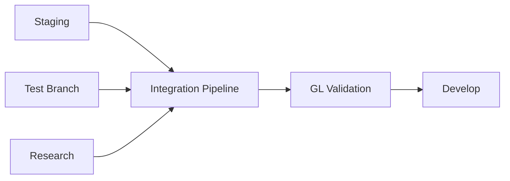

# @GL-governed
# @GL-layer: GL90-99
# @GL-semantic: documentation
# @GL-audit-trail: ../../engine/governance/GL_SEMANTIC_ANCHOR.json
#
# GL Unified Charter Activated
# Multi-Branch Integration - Documentation Structure

```
machine-native-ops/
│
├── MULTI_BRANCH_INTEGRATION_SUMMARY.md          # ⭐ Executive Summary
│   └── Strategic overview, decisions, outcomes
│
└── docs/
    │
    ├── INTEGRATION_DOCS_INDEX.md                 # 📚 Documentation Index
    │   └── Navigation guide for all documents
    │
    ├── MULTI_BRANCH_INTEGRATION_GUIDE.md         # 📖 Implementation Guide
    │   └── 10-day step-by-step process
    │
    ├── MULTI_BRANCH_INTEGRATION_QUICKREF.md      # 🎯 Quick Reference
    │   └── Commands, checklists, troubleshooting
    │
    ├── architecture/
    │   └── multi_branch_integration_Architecture.md  # 🏗️ Architecture Spec
    │       ├── System Context Diagram (C4)
    │       ├── Component Diagram (C4)
    │       ├── Data Flow Diagram
    │       ├── Sequence Diagram
    │       └── GL Compliance Checkpoints
    │
    └── adr/
        ├── ADR-003-sequential-integration-strategy.md    # 📋 ADR-003
        │   └── Decision: Sequential integration (not simultaneous)
        │
        ├── ADR-004-gl-first-validation.md                # 📋 ADR-004
        │   └── Decision: GL validation after each branch
        │
        └── ADR-005-conflict-resolution-priority.md       # 📋 ADR-005
            └── Decision: Priority matrix for conflicts (P0-P6)
```

## Document Roles

### For Leadership/Executives
```
MULTI_BRANCH_INTEGRATION_SUMMARY.md
├── Strategic Goals
├── Timeline & Resources
├── Risk Assessment
├── Expected Outcomes
└── Recommendations
```

### For Architects/Technical Leads
```
multi_branch_integration_Architecture.md
├── System Diagrams (C4 Model)
├── GL Governance Mapping
├── Architecture Patterns
└── Technical Decisions

+

ADR-003, ADR-004, ADR-005
├── Decision Rationale
├── Alternatives Considered
├── Consequences
└── GL Impact Analysis
```

### For Developers/Engineers
```
MULTI_BRANCH_INTEGRATION_GUIDE.md
├── Phase 1: Analysis (Days 1-2)
├── Phase 2: Integration (Days 3-8)
│   ├── Staging (Days 3-4)
│   ├── Test (Days 5-6)
│   └── Research (Days 7-8)
├── Phase 3: Validation (Days 9-10)
└── Rollback Procedures

+

MULTI_BRANCH_INTEGRATION_QUICKREF.md
├── Quick Start Commands
├── Conflict Resolution Matrix
├── Validation Thresholds
└── Emergency Procedures
```

### For QA/Reviewers
```
Validation Sections in:
├── MULTI_BRANCH_INTEGRATION_GUIDE.md
│   ├── GL Validation Gates
│   ├── Test Suite Execution
│   └── Quality Checks
│
└── ADR-004-gl-first-validation.md
    ├── Validation Approach
    ├── Gate Definitions
    └── Success Criteria
```

## Key Architectural Elements

### Integration Strategy


### Validation Gates
```
After Each Branch Integration:
┌─────────────────────────────────┐
│ Gate 1: Semantic Validation     │ ← GL Layer Boundaries
├─────────────────────────────────┤
│ Gate 2: Quantum Validation      │ ← Quantum-Classical Hybrid
├─────────────────────────────────┤
│ Gate 3: Compliance + Tests      │ ← Full System Validation
└─────────────────────────────────┘
```

### Conflict Resolution Priority
```
P0: GL Violations        → 🔴 BLOCK
P1: Core Engine          → 🟡 Manual Review
P2: Tests/Tools          → 🟢 Prefer Test
P3: Documentation        → 🟢 Merge All
P4: Configuration        → 🟢 Prefer Staging
P5: Scripts              → 🟢 Newest
P6: Dependencies         → 🟡 Manual, Prefer Staging
```

## Integration Timeline

```
Day 1-2:  Analysis & Planning
Day 3-4:  Staging Integration     → Checkpoint 1
Day 5-6:  Test Integration        → Checkpoint 2
Day 7-8:  Research Integration    → Checkpoint 3
Day 9-10: Final Validation & PR   → Merge
```

## GL Governance Layers Affected

```
GL00-09 Strategic       │ Low Impact    │ Documentation Review
GL10-29 Operational     │ Medium Impact │ Policy Validation
GL30-49 Execution       │ HIGH Impact   │ Full Validation ⚠️
GL50-59 Observability   │ Medium Impact │ Metric Consistency
GL60-80 Feedback        │ Low Impact    │ Standard Validation
GL81-83 Extended        │ Low Impact    │ Integration Tests
GL90-99 Meta            │ CRITICAL      │ Semantic Validation ⚠️
```

## Success Metrics

### Technical Success
- ✅ GL Compliance: 100%
- ✅ Test Pass Rate: 100%
- ✅ Code Quality: Grade A
- ✅ Security Vulns: 0
- ✅ Performance: No regression

### Process Success
- ✅ Timeline: Within 10 days
- ✅ Conflicts: All documented
- ✅ Audit Trail: Complete
- ✅ Team: Aligned

## Document Statistics

| Document | Size | Lines | Purpose |
|----------|------|-------|---------|
| Integration Summary | ~13KB | ~400 | Executive overview |
| Architecture Spec | ~16KB | ~500 | Technical design |
| ADR-003 | ~6KB | ~180 | Sequential strategy |
| ADR-004 | ~10KB | ~300 | GL validation |
| ADR-005 | ~14KB | ~450 | Conflict resolution |
| Implementation Guide | ~19KB | ~600 | Step-by-step process |
| Quick Reference | ~6KB | ~200 | Commands & checklists |
| Docs Index | ~8KB | ~250 | Navigation |
| **Total** | **~92KB** | **~2,880** | Complete documentation |

## Navigation Quick Links

### Start Here
- 👔 **Executive?** → [MULTI_BRANCH_INTEGRATION_SUMMARY.md](../MULTI_BRANCH_INTEGRATION_SUMMARY.md)
- 🏗️ **Architect?** → [multi_branch_integration_Architecture.md](architecture/multi_branch_integration_Architecture.md)
- 💻 **Developer?** → [MULTI_BRANCH_INTEGRATION_GUIDE.md](MULTI_BRANCH_INTEGRATION_GUIDE.md)
- 🎯 **Need Quick Ref?** → [MULTI_BRANCH_INTEGRATION_QUICKREF.md](MULTI_BRANCH_INTEGRATION_QUICKREF.md)

### Understand Decisions
- 📋 **Why Sequential?** → [ADR-003](adr/ADR-003-sequential-integration-strategy.md)
- 📋 **Why GL-First?** → [ADR-004](adr/ADR-004-gl-first-validation.md)
- 📋 **How to Resolve Conflicts?** → [ADR-005](adr/ADR-005-conflict-resolution-priority.md)

### Find Everything
- 📚 **Documentation Index** → [INTEGRATION_DOCS_INDEX.md](INTEGRATION_DOCS_INDEX.md)

## Architectural Highlights

### Design Patterns Used
- ✅ **Sequential Processing** - One branch at a time
- ✅ **Gate Pattern** - Validation gates between stages
- ✅ **Checkpoint Pattern** - Rollback points after each stage
- ✅ **Priority Matrix** - Structured conflict resolution
- ✅ **Progressive Validation** - Validate continuously

### GL Compliance Mechanisms
- ✅ **Semantic Validation** - Layer boundary checking
- ✅ **Quantum Validation** - Quantum-classical hybrid
- ✅ **Artifact Validation** - Governance artifact integrity
- ✅ **DAG Validation** - Dependency graph topology
- ✅ **Filesystem Validation** - FHS compliance

### Risk Mitigation Strategies
- ✅ **Sequential Integration** - Reduces complexity
- ✅ **Validation Gates** - Early issue detection
- ✅ **Checkpoints** - Rollback capability
- ✅ **Documentation** - Complete audit trail
- ✅ **Priority Matrix** - Consistent decisions

---

**Documentation Set**: Multi-Branch Integration  
**Version**: 1.0.0  
**Date**: 2026-01-27  
**Author**: Senior Architect Agent  
**GL Layer**: GL30-49 Execution Layer  
**Status**: ✅ Complete and Ready for Use
