# @GL-governed
# @GL-layer: GL90-99
# @GL-semantic: documentation
# @GL-audit-trail: ../../engine/governance/GL_SEMANTIC_ANCHOR.json
#
# GL Unified Charter Activated
# Frontend-Backend Separation Architecture Diagrams

> **GL Layer**: GL00-09 Strategic Layer  
> **Purpose**: Visual architecture documentation for frontend-backend separation

## System Architecture Overview

### High-Level Architecture

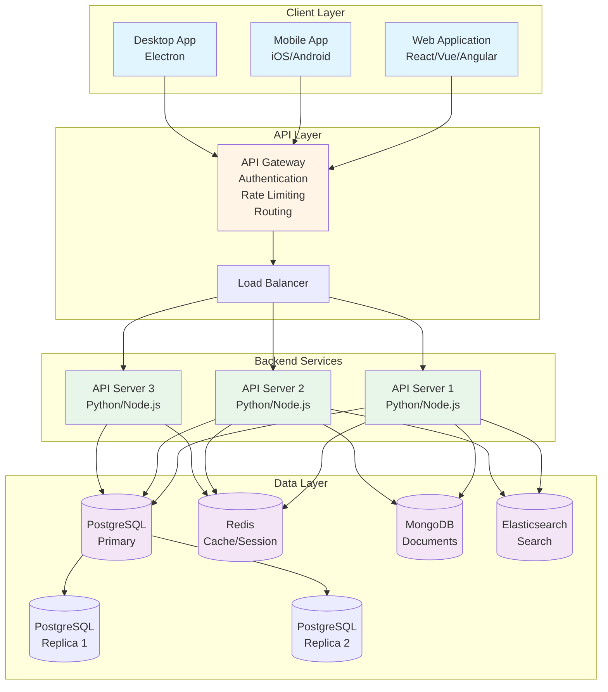

### API-First Development Workflow

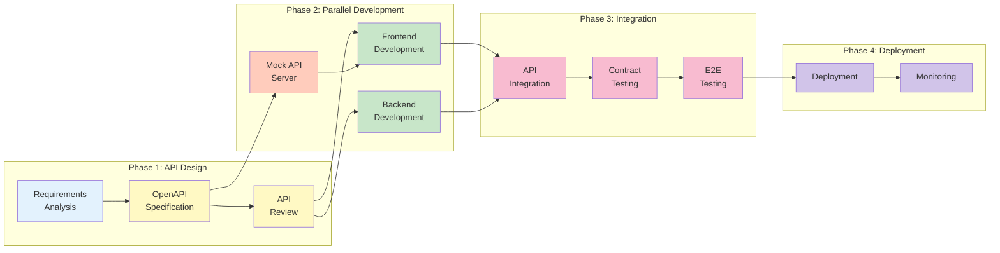

### Request Flow Sequence

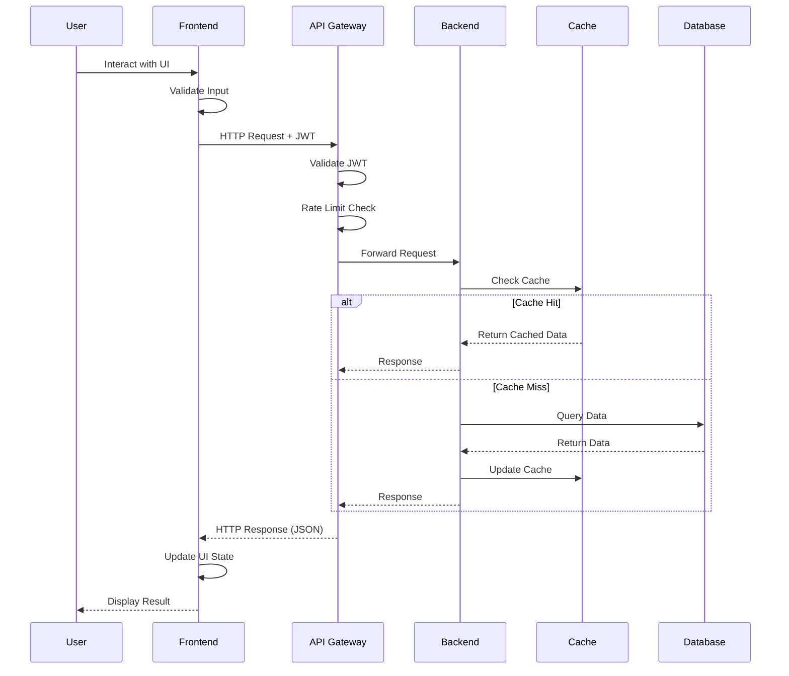

### Authentication Flow

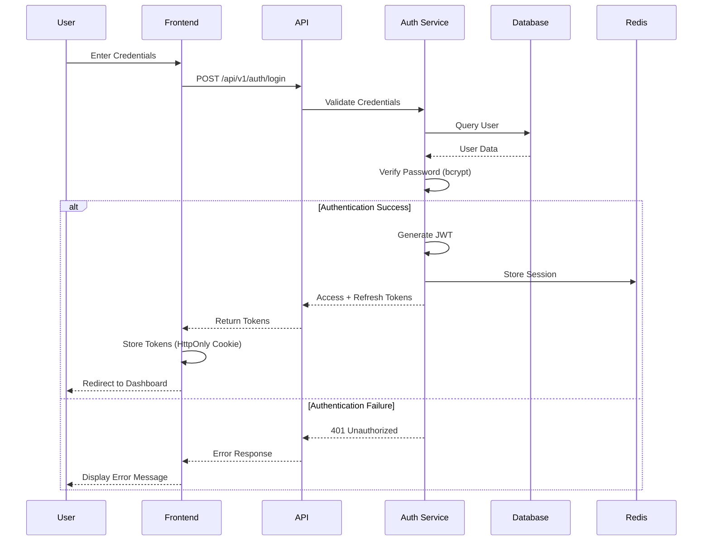

### Data Flow Architecture

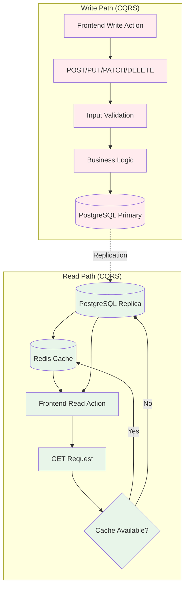

### Deployment Architecture

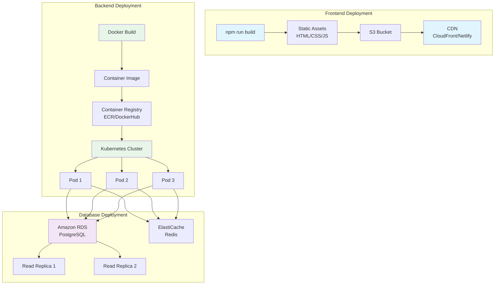

### Technology Stack

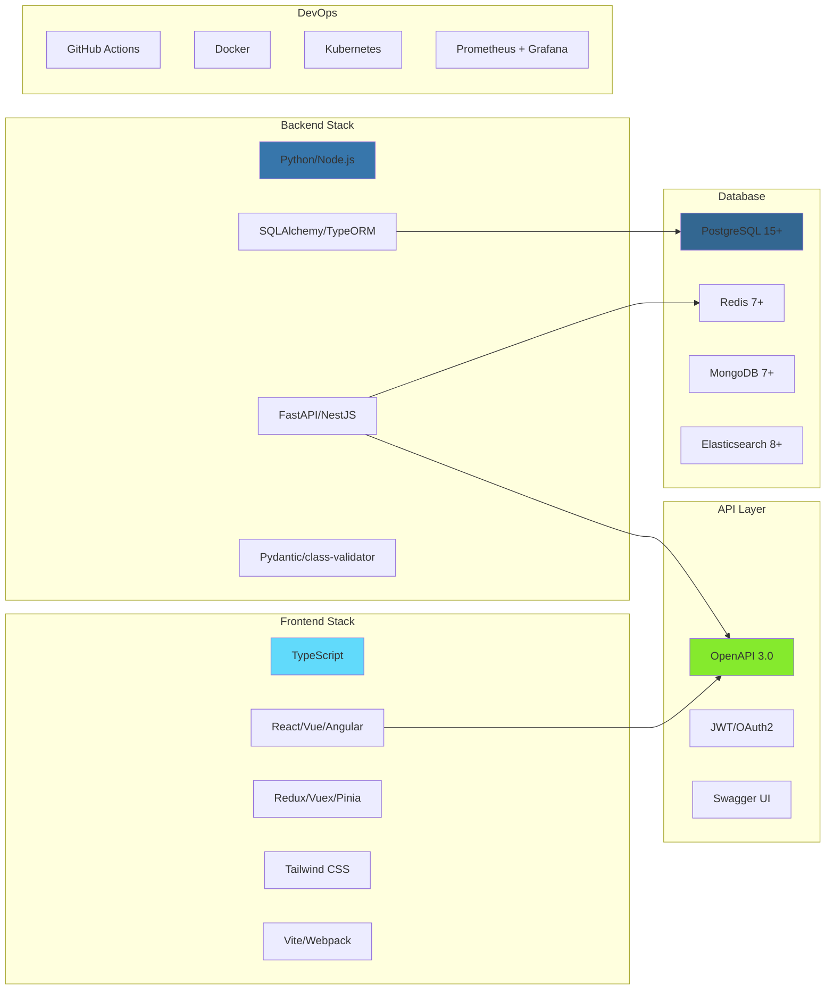

### Security Architecture

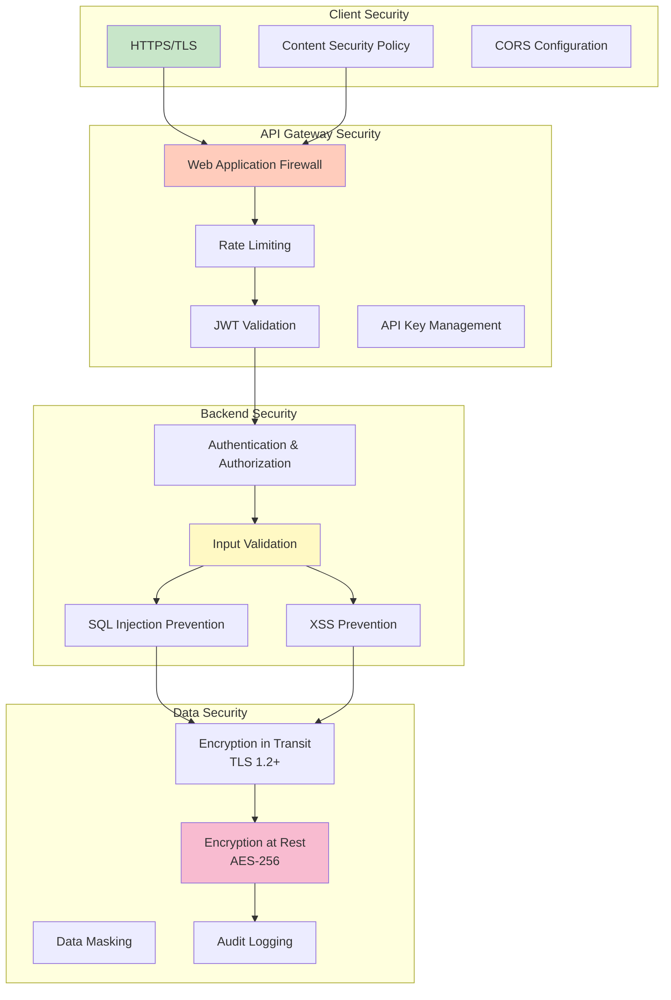

### Monitoring and Observability

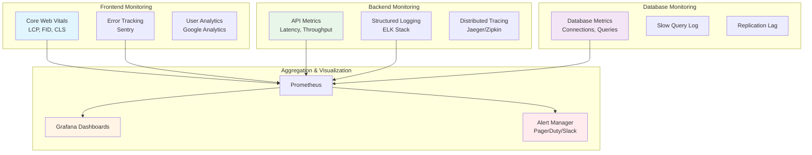

## Component Interaction Patterns

### RESTful API Design Pattern

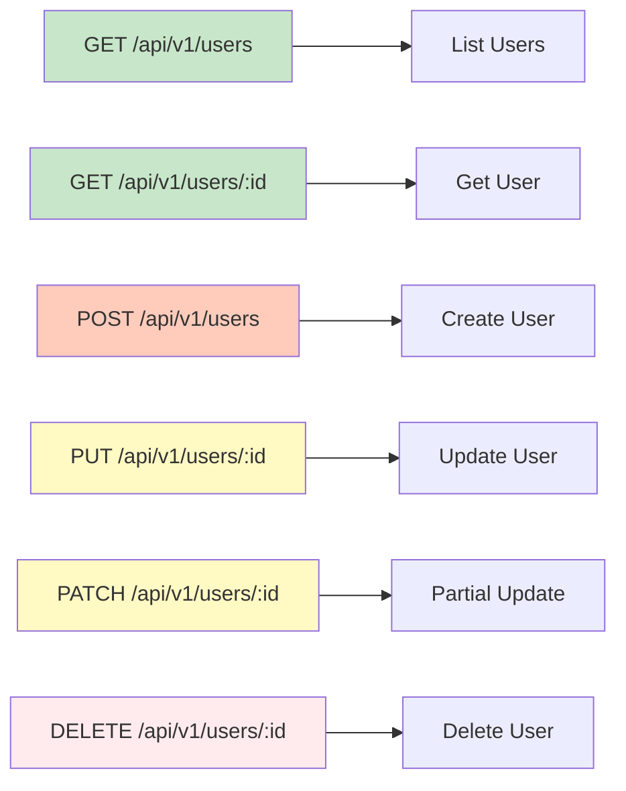

### Error Handling Flow

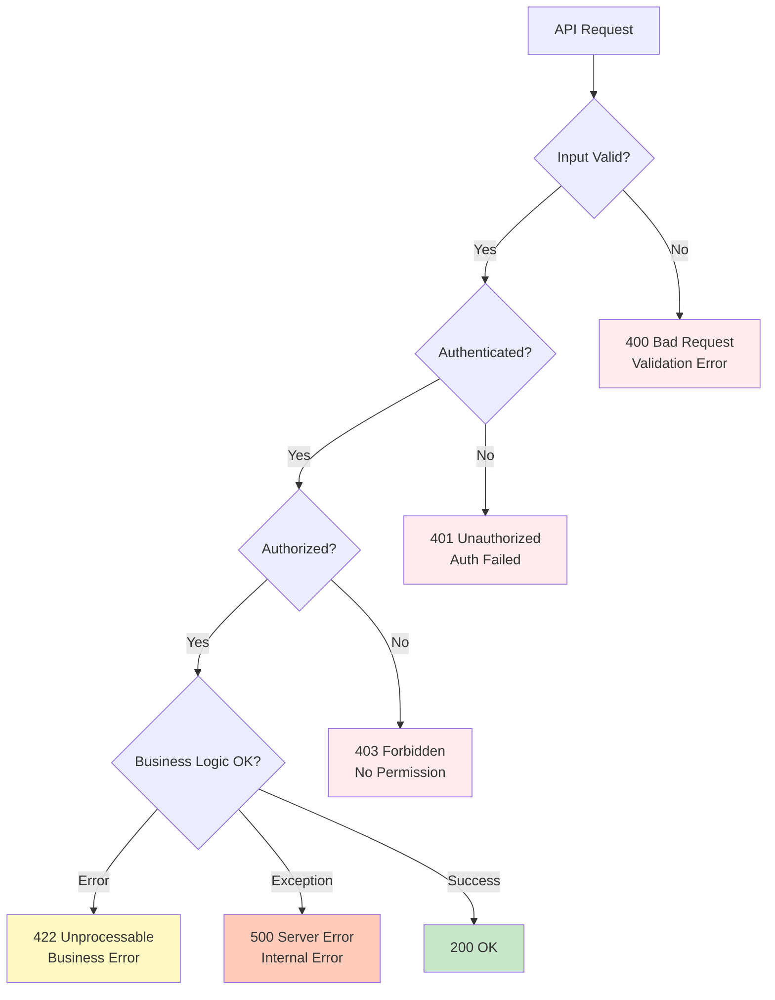

---

## References

- **Frontend-Backend Separation Architecture**: `gl/00-strategic/artifacts/frontend-backend-separation-architecture.yaml`
- **API Design Specification**: `gl/30-execution/artifacts/api-design-specification.yaml`
- **Database Architecture Specification**: `gl/20-data/artifacts/database-architecture-specification.yaml`

---

**Last Updated**: 2026-01-27  
**Maintained by**: Architecture Team
