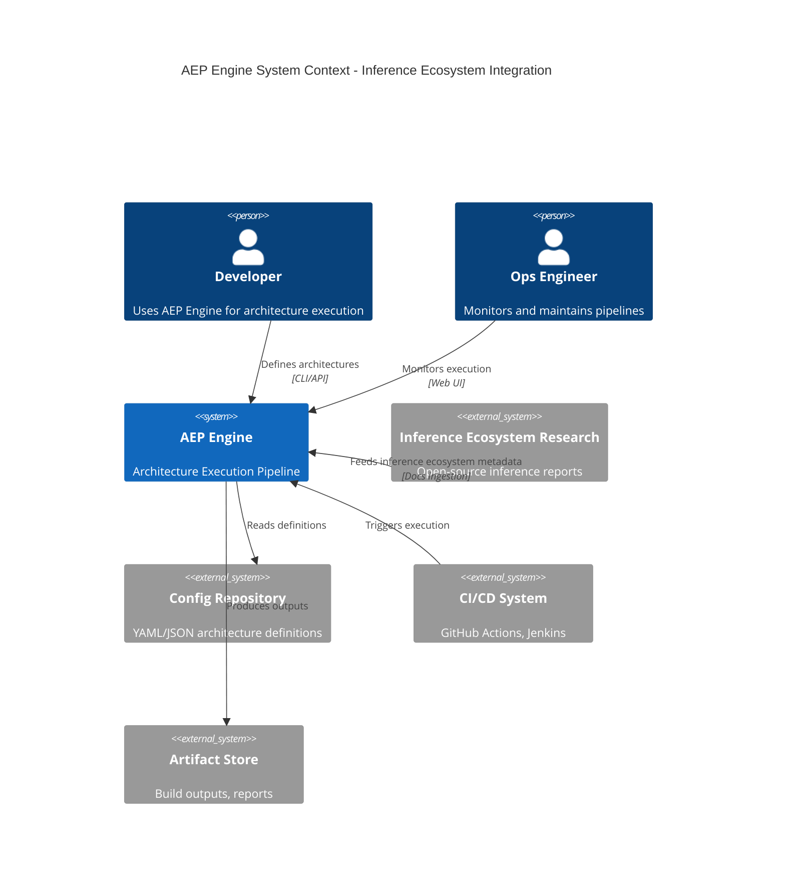
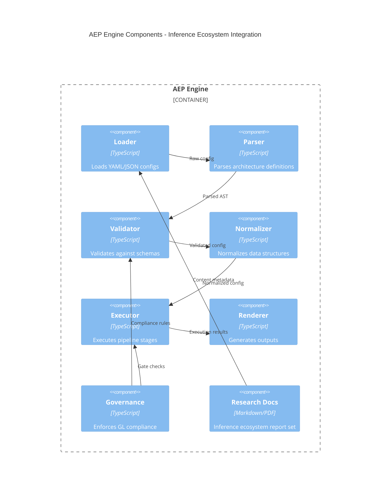
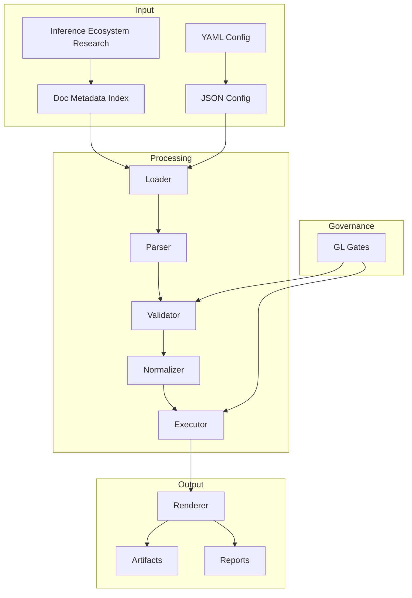
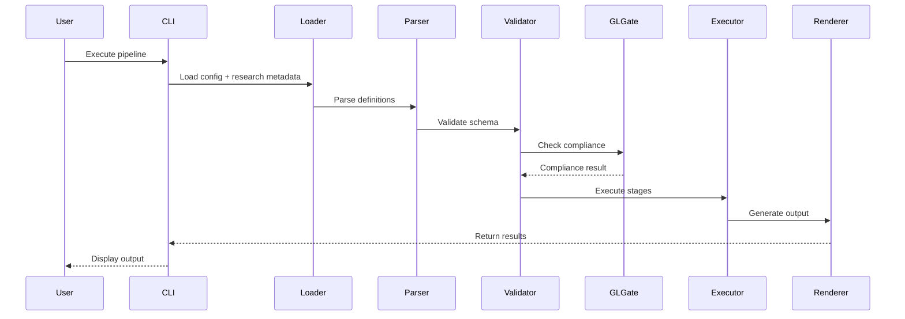

<!-- @GL-governed -->
<!-- @GL-layer: GL90-99 -->
<!-- @GL-semantic: governed-documentation -->
<!-- @GL-audit-trail: engine/governance/GL_SEMANTIC_ANCHOR.json -->

# GL Unified Charter Activated
# Inference Ecosystem Integration Architecture

<!-- GL Layer: GL30-49 Execution Layer -->
<!-- Purpose: Architecture integration for inference ecosystem research into AEP Engine pipeline -->

## Executive Summary

This document integrates the open-source inference ecosystem research into the MachineNativeOps AEP Engine architecture. It provides a governance-aligned integration path, architectural diagrams, and non-functional requirements to ensure the research artifacts are consumable by the AEP Engine without altering existing pipeline semantics.

## Context & Scope

### Context
- Research assets live under `research/open-source-inference-ecosystem/`.
- The AEP Engine uses a pipeline (Loader → Parser → Validator → Executor → Renderer) with governance gates.
- Integration focuses on documentation ingestion, governance mapping, and execution-ready metadata for downstream use.

### Scope
- Document ingestion of inference ecosystem research.
- Architecture alignment with AEP Engine modules.
- Governance mapping to GL layers.
- No changes to executable runtime or data plane code.

## System Context Diagram

The system context diagram illustrates how inference ecosystem research feeds into the AEP Engine alongside existing configuration sources and delivery targets.

## Component Diagram

The component diagram highlights the AEP Engine pipeline components and the research document inputs, emphasizing governance enforcement.

## Data Flow Diagram

The data flow diagram shows how research metadata flows through the AEP Engine processing stages with GL gate checks.

## Sequence Diagram

The sequence diagram captures the execution flow when the CLI loads research metadata along with standard configurations.

## GL Governance Mapping

| Integration Artifact | Location | GL Layer | Rationale |
| --- | --- | --- | --- |
| Inference Ecosystem Research Reports | `research/open-source-inference-ecosystem/` | GL30-49 | Execution-layer knowledge inputs for AEP pipeline |
| Architecture Integration Doc | `docs/architecture/inference_ecosystem_integration_Architecture.md` | GL30-49 | Execution guidance with governance mapping |
| ADR (Integration Decision) | `docs/adr/ADR-001-inference-ecosystem-integration.md` | GL10-29 | Operational decision record |

## Non-Functional Requirements (NFRs)

| Category | Requirement | Rationale | Validation |
| --- | --- | --- | --- |
| Reliability | Research ingestion must not alter runtime pipeline semantics | Preserve GL governance stability | Documentation-only change review |
| Traceability | All research artifacts must be referenced via documentation index | Maintain semantic lineage | Documentation manifest update |
| Compliance | Integration must respect GL layer boundaries | Governance alignment | Governance review check |
| Maintainability | Provide clear entry points for research artifacts | Minimize future onboarding effort | Documentation portal link |
| Security | No sensitive data in research integration | Avoid leaks in documentation | Manual content review |

## Integration Steps

1. Maintain research artifacts in `research/open-source-inference-ecosystem/`.
2. Reference research artifacts from documentation portal.
3. Capture integration decision via ADR for governance traceability.
4. Ensure no runtime code changes are required.

## Architecture Decisions & Rationale

### Decision: Documentation-Only Integration
The inference ecosystem research is integrated as documentation-only artifacts, keeping the AEP Engine runtime unaffected. This preserves GL governance boundaries and avoids altering executor or validator behavior.

### Decision: GL Layer Alignment
The integration documentation is classified under GL30-49, while the ADR is classified under GL10-29 to reflect its operational governance impact. This aligns with existing governance separation between execution guidance and decision tracking.

## Risks & Mitigations

| Risk | Impact | Mitigation |
| --- | --- | --- |
| Research content becomes stale | Medium | Add periodic review cadence in governance backlog |
| Overlap with other research streams | Low | Document source-of-truth in portal |
| Misalignment with GL governance layers | Medium | Keep ADR updated and review in compliance checks |
