# Root Responsibility Boundary Structure

目錄已依「責任邊界」重新命名（`responsibility-*`），以避免職責重疊並強化治理可追溯性。表中標註的「(formerly …)」指出舊目錄名稱，方便交叉比對與遷移。

## 根層目錄樹

```text
.
├── responsibility-governance-anchor-boundary/          (baseline specs; former governance-root-anchor)
├── responsibility-governance-execution-boundary/       (pipelines; former governance-execution-engine)
├── responsibility-governance-sensing-boundary/         (inventory; former governance-scanner-sensing)
├── responsibility-governance-specs-boundary/           (core specs; former governance)
├── responsibility-global-policy-boundary/              (global policies; former global-governance)
├── responsibility-gl-layers-boundary/                  (GL00-99 layers; former gl-governance)
├── responsibility-gap-boundary/                        (gap analysis; former gap-governance)
├── responsibility-gates-boundary/                      (operational gates; former gates-governance)
├── responsibility-gateway-boundary/                    (API/network gateway; former gateway-governance)
├── responsibility-guardrails-boundary/                 (safety & compliance; former guardrails-governance)
├── responsibility-gcp-boundary/                        (GCP-specific governance; former gcp-governance)
├── responsibility-generation-boundary/                 (artifact generation; former generation-governance)
├── responsibility-quantum-stack-boundary/              (GQS; former gqs-governance)
├── responsibility-group-boundary/                      (group/tenant rules; former group-governance)
├── responsibility-observability-grafana-boundary/      (dashboards; former grafana-governance)
├── responsibility-mnga-architecture-boundary/          (strategic MNGA; former mnga-governance)
├── responsibility-mno-operations-boundary/             (ops governance; former mno-governance)
└── responsibility-namespace-governance-boundary/       (namespace controls; former ng-namespace-governance)
```

```mermaid
flowchart TD
    root((Repo Root))
    root --> anchor[responsibility-governance-anchor-boundary]
    root --> exec[responsibility-governance-execution-boundary]
    root --> sense[responsibility-governance-sensing-boundary]
    root --> specs[responsibility-governance-specs-boundary]
    root --> global[responsibility-global-policy-boundary]
    root --> gl[responsibility-gl-layers-boundary]
    root --> gap[responsibility-gap-boundary]
    root --> gates[responsibility-gates-boundary]
    root --> gateway[responsibility-gateway-boundary]
    root --> guardrails[responsibility-guardrails-boundary]
    root --> gcp[responsibility-gcp-boundary]
    root --> generation[responsibility-generation-boundary]
    root --> quantum[responsibility-quantum-stack-boundary]
    root --> group[responsibility-group-boundary]
    root --> grafana[responsibility-observability-grafana-boundary]
    root --> mnga[responsibility-mnga-architecture-boundary]
    root --> mno[responsibility-mno-operations-boundary]
    root --> namespace[responsibility-namespace-governance-boundary]
```



## 目錄責任說明

### responsibility-governance-anchor-boundary (formerly governance-root-anchor)
- 用途：治理基線、語義樹、雜湊邊界、事件模型與驗證規則的唯一來源。
- 責任邊界：只維護權威規格與簽章；不執行流水線、不產生證據。
- 職責分離：與 execution/sensing 僅單向介面，禁止在此儲存運行腳本。
- 違規處理：任何未簽章或來源不明的檔案全部拒收並標註為漂移；需透過變更管控重送。
- 依賴關係：提供規則給 sensing、execution；接收由治理變更流程批准的更新。
- 存取控制：僅治理/架構維運者可寫；其他角色唯讀。

### responsibility-governance-execution-boundary (formerly governance-execution-engine)
- 用途：執行流水線、門檻、證據驗證與重放。
- 責任邊界：只負責執行與產出事件/證據；不得修改 anchor 規格。
- 職責分離：與 sensing 共用輸入報告，但不掃描；與 anchor 只讀取規則不回寫。
- 違規處理：偵測到門檻或一致性失敗即停止並記錄事件，要求補救後重跑。
- 依賴關係：依賴 anchor 規格與 sensing 報告；輸出事件給 observability 及 anchor 審核。
- 存取控制：CI/CD 執行者可觸發；治理審核者核准流程配置變更。

### responsibility-governance-sensing-boundary (formerly governance-scanner-sensing)
- 用途：掃描模組、語義附掛、雜湊邊界、流水線與門檻清單。
- 責任邊界：只做盤點與報告；不執行、不中斷系統。
- 職責分離：與 execution 解耦；報告交由 execution 使用；不保存策略基線。
- 違規處理：缺失或漂移即在報告中標記為待補救；阻擋推進但不修改來源。
- 依賴關係：讀取 anchor 規格作對照；輸出報告給 execution/anchor。
- 存取控制：平台掃描工作負責人可寫；其他角色唯讀。

### responsibility-governance-specs-boundary (formerly governance)
- 用途：核心治理規格、核⼼工作流與內核定義。
- 責任邊界：儲存治理政策與工作流描述；不保存雲端或產品特定配置。
- 職責分離：政策定義與執行區隔；執行腳本放在 execution 邊界。
- 違規處理：若發現執行腳本/暫存檔放入，移出並在提交訊息記錄矯正。
- 依賴關係：被 anchor 收錄並供 execution 讀取；與 global/guardrails 交換政策。
- 存取控制：治理編輯者可寫；其他角色 PR 審核後合併。

### responsibility-global-policy-boundary (formerly global-governance)
- 用途：全域設定、命名規則、全域政策。
- 責任邊界：只涵蓋跨域共用設定；不含特定雲供應商或產品設定。
- 職責分離：與 namespace 邊界協調命名；與 gl-layers/anchor 保持政策對齊。
- 違規處理：若出現特定平台配置，移至相應平台邊界並在違規紀錄中註記。
- 依賴關係：為 anchor 提供全域原則；供 execution 讀取預設策略。
- 存取控制：平台架構與治理團隊可寫；其他角色需審核。

### responsibility-gl-layers-boundary (formerly gl-governance)
- 用途：GL00-99 層級資料與工件。
- 責任邊界：只放 GL 層次定義、稽核與指引；不放運行腳本或平台設定。
- 職責分離：與 anchor 對齊語義層；與 execution/sensing 只共享層級定義。
- 違規處理：若有運行腳本或平台特定檔案，移至 execution 或相應平台邊界。
- 依賴關係：提供層定義給 anchor、global、mnga/mno；接受 guardrails 的約束。
- 存取控制：GL 維護者可寫；其他角色唯讀。

### responsibility-gap-boundary (formerly gap-governance)
- 用途：缺口分析、補救計畫與追蹤。
- 責任邊界：只記錄 gap 模板、分析、補救方案；不存放實際修復程式碼。
- 職責分離：修復行動在對應產品/平台倉儲進行；此處僅保留治理層追蹤。
- 違規處理：若提交修復程式碼，轉移到對應工程目錄並留下追蹤記錄。
- 依賴關係：與 execution/guardrails 分享缺口清單；與 anchor 對齊狀態欄位。
- 存取控制：治理 PM/風險管理可寫；其他角色 PR 審核。

### responsibility-gates-boundary (formerly gates-governance)
- 用途：營運門檻定義、核准矩陣與執行規則。
- 責任邊界：只定義門檻條件與流程；執行交給 execution 邊界。
- 職責分離：與 gateway 邊界區分（前者是流程門檻，後者是流量/網路路由）。
- 違規處理：若加入網路配置或腳本，移至 gateway 或 execution 並記錄。
- 依賴關係：依 anchor 的政策；被 execution 消費；與 guardrails 協調安全要求。
- 存取控制：流程/安全審批者可寫；CI/CD 讀取唯讀。

### responsibility-gateway-boundary (formerly gateway-governance)
- 用途：API/網路閘道規格、路由、安全與監控需求。
- 責任邊界：只描述閘道設計與策略；不包含實際服務程式碼。
- 職責分離：與 gates 邊界區隔（路由 vs. 流程門檻）。
- 違規處理：若發現應用邏輯或部署腳本，移至對應服務倉儲或 execution。
- 依賴關係：依 global/guardrails 的策略；輸出需求給 observability。
- 存取控制：平台網路/安全負責人可寫；其他角色需審核。

### responsibility-guardrails-boundary (formerly guardrails-governance)
- 用途：安全與合規防護欄、PII/安全檢測策略。
- 責任邊界：定義安全與合規規則；不負責執行或監控。
- 職責分離：執行由 execution；監控由 observability；政策由 global/anchor。
- 違規處理：若將掃描腳本放入，移到 sensing 或 execution 並記錄。
- 依賴關係：約束 anchor、execution、gateway；與 global 協作政策一致性。
- 存取控制：安全/合規團隊可寫；其他角色需審核。

### responsibility-gcp-boundary (formerly gcp-governance)
- 用途：GCP 特定治理策略、標籤、IAM 與部署約束。
- 責任邊界：僅限 GCP；不含多雲或本地設定。
- 職責分離：跨雲策略在 global；執行腳本在 execution。
- 違規處理：若發現 AWS/Azure 內容，移至適當平台或 global。
- 依賴關係：受 anchor/guardrails 約束；與 gateway/observability 對齊雲端監控需求。
- 存取控制：雲端平台團隊可寫；其他角色需審核。

### responsibility-generation-boundary (formerly generation-governance)
- 用途：工件生成策略、版本/來源標記、元資料追蹤。
- 責任邊界：僅定義生成與追蹤規則；不保存生成後的二進位或大型工件。
- 職責分離：生成工具/腳本放在 execution；觀測放在 observability。
- 違規處理：若上傳二進位，移至 artifacts 儲存並記錄。
- 依賴關係：與 anchor 對齊可追溯性規則；與 gates/guardrails 協同簽章要求。
- 存取控制：版本治理與釋出版管可寫；其他角色需審核。

### responsibility-quantum-stack-boundary (formerly gqs-governance)
- 用途：GQS（Governance Quantum Stack）層級、契約與驗證。
- 責任邊界：僅定義量子治理模型；不包含傳統運維政策。
- 職責分離：與 gl-layers 區分（一般 GL 層 vs. 量子治理模型）。
- 違規處理：不相關的傳統政策移至 gl-layers 或 anchor。
- 依賴關係：與 anchor/guardrails 對齊安全模型；輸出指標給 observability。
- 存取控制：量子治理/研究團隊可寫；其他角色需審核。

### responsibility-group-boundary (formerly group-governance)
- 用途：群組/租戶責任、共享資源規則與跨團隊觀測。
- 責任邊界：僅管理群組層規則；不處理單一應用或全域政策。
- 職責分離：與 namespace 邊界配合命名；與 global 區分全域規則。
- 違規處理：若放入專案專屬設定，移至對應專案並記錄。
- 依賴關係：消費 global/guardrails 原則；輸出群組監控需求給 observability。
- 存取控制：平台治理與群組負責人可寫；其他角色需審核。

### responsibility-observability-grafana-boundary (formerly grafana-governance)
- 用途：Grafana 仪表板與觀測規範（資料源、面板標準、告警閾值）。
- 責任邊界：只定義觀測標準與模板；不存放實際營運資料。
- 職責分離：與 execution 的部署分離；與 guardrails/anchor 的政策對齊。
- 違規處理：若匯入敏感數據樣本，立刻移除並記錄遮蔽措施。
- 依賴關係：接收 execution 事件與 sensing 報告的指標需求；向 anchor 回饋觀測缺口。
- 存取控制：觀測/平台團隊可寫；其他角色唯讀。

### responsibility-mnga-architecture-boundary (formerly mnga-governance)
- 用途：Machine Native Governance Architecture（MNGA）策略、契約與標準。
- 責任邊界：聚焦戰略/架構層；不含營運細節或流水線。
- 職責分離：與 mno-operations 邊界區隔（策略 vs. 執行）。
- 違規處理：若混入運維流程，移至 mno-operations；保持架構層純度。
- 依賴關係：為 anchor 提供頂層策略；對 global/guardrails 施加架構原則。
- 存取控制：架構治理委員會可寫；其他角色需審核。

### responsibility-mno-operations-boundary (formerly mno-governance)
- 用途：Machine Native Ops 運維治理、生命週期、自动化政策。
- 責任邊界：聚焦運營政策與流程；不含基線或架構原則。
- 職責分離：策略由 mnga；執行由 execution；觀測由 observability。
- 違規處理：若放入基線規格或架構原則，移至 mnga 或 anchor。
- 依賴關係：遵循 anchor/global/guardrails；向 execution 提供運維流程。
- 存取控制：運維治理團隊可寫；其他角色需審核。

### responsibility-namespace-governance-boundary (formerly ng-namespace-governance)
- 用途：命名空間、域名、租戶與 API namespace 管理。
- 責任邊界：只處理命名與隔離規則；不含全域策略或路由細節。
- 職責分離：與 global（全域策略）與 gateway（路由）區隔；與 group 協調租戶邊界。
- 違規處理：若放入流量/路由設定，移至 gateway；若放入全域策略，移至 global。
- 依賴關係：遵循 global 命名原則；為 anchor/guardrails 提供 namespace 控制點。
- 存取控制：平台命名/租戶治理者可寫；其他角色需審核。

## 閉環設計與覆蓋

- **檢測→執行→基線回饋**：sensing 報告驅動 execution，執行結果與漂移回饋 anchor，形成閉環。
- **策略→控制→觀測**：global/mnga/mno/guardrails 提供策略，gates/gateway/gcp/generation 執行控制，observability-grafana 監測並回饋缺口。
- **範圍覆蓋**：戰略 (mnga)、運營 (mno)、全域 (global/namespace)、安全 (guardrails)、平臺/雲 (gl-layers/gcp/gateway)、流程門檻 (gates)、生成/量子 (generation/quantum-stack)、群組租戶 (group)、觀測 (observability) 均有明確邊界，避免灰色地帶。
- **違規路徑**：任何放錯位置的檔案以「移至正確邊界 + 留存記錄 + 通知相關責任人」為處理原則。
