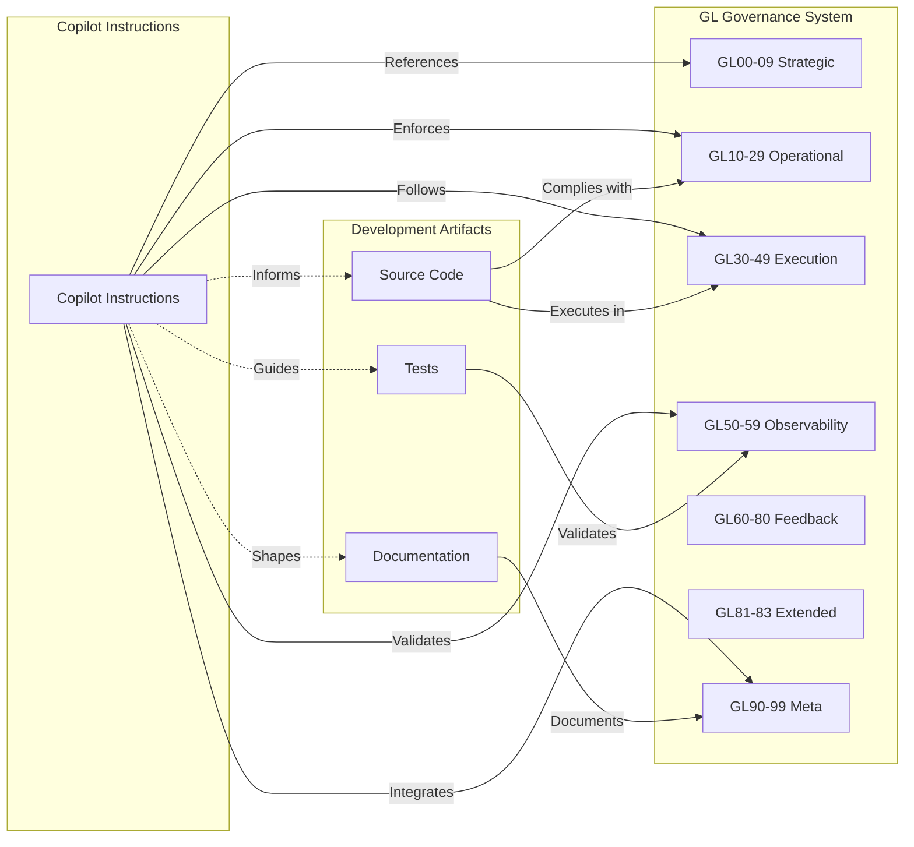
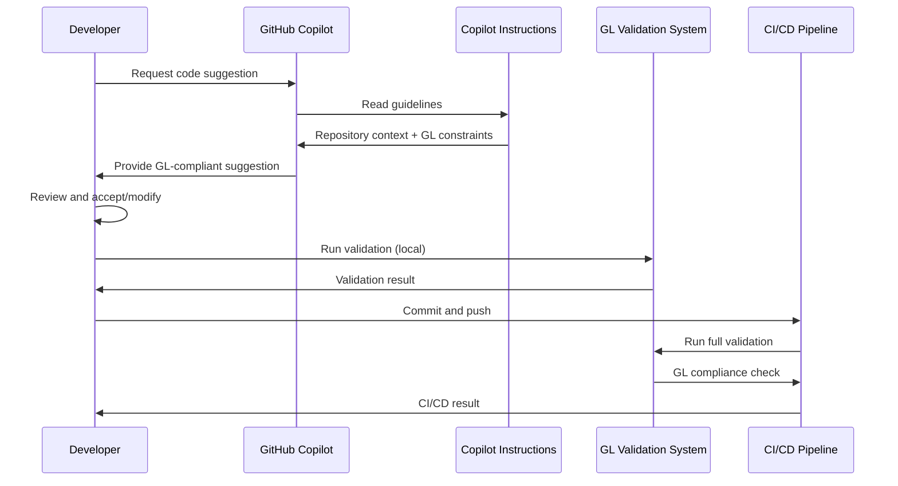
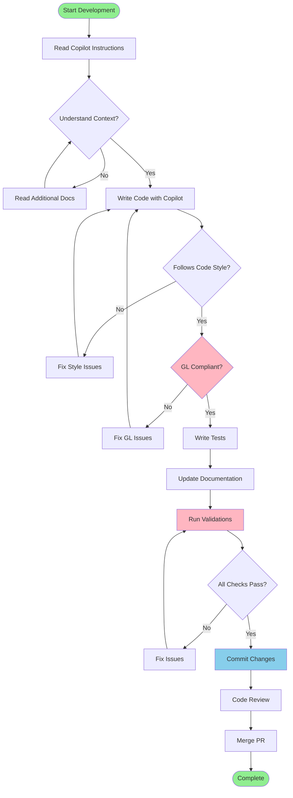
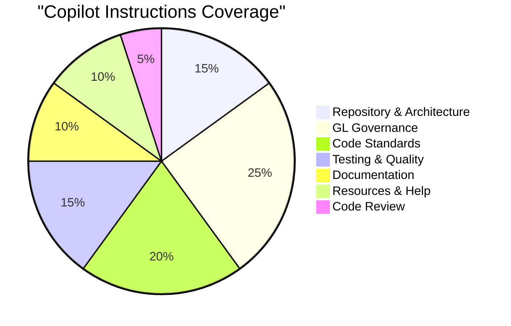
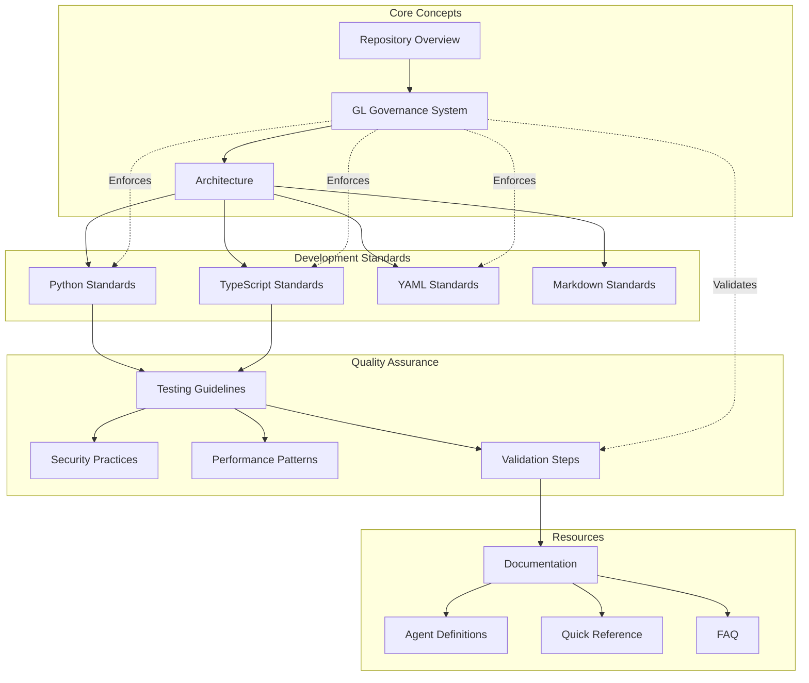
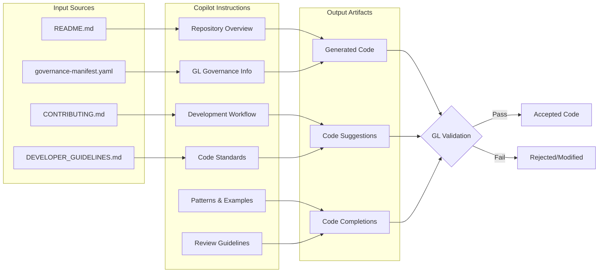
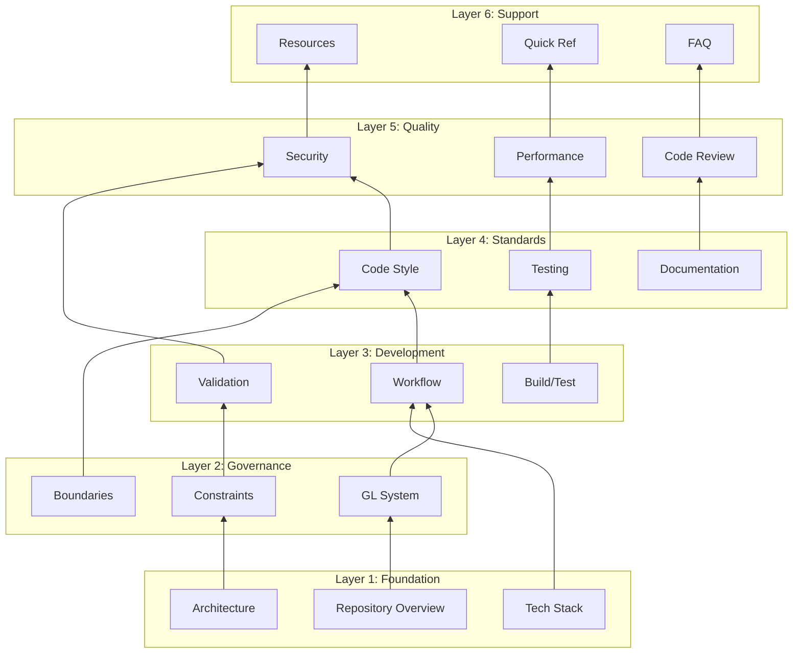

# @GL-governed
# @GL-layer: GL90-99
# @GL-semantic: documentation
# @GL-audit-trail: ../../engine/governance/GL_SEMANTIC_ANCHOR.json
#
# GL Unified Charter Activated
# Copilot Instructions Architecture

This document provides architectural diagrams for the GitHub Copilot instructions structure.

---

## Instructions Structure Overview

```mermaid
graph TB
    subgraph "GitHub Copilot Instructions"
        A[Repository Overview] --> B[GL Governance System]
        B --> C[Development Workflow]
        C --> D[Code Style & Conventions]
        D --> E[Common Patterns]
        E --> F[Testing Guidelines]
        F --> G[Documentation Requirements]
        G --> H[Anti-Patterns]
        H --> I[Code Review Instructions]
        I --> J[Additional Resources]
        J --> K[Quick Reference]
        K --> L[Getting Help]
    end
    
    style A fill:#e1f5ff
    style B fill:#ffe1e1
    style C fill:#e1ffe1
    style D fill:#fff5e1
    style I fill:#f5e1ff
```

---

## GL Governance Integration

---

## Code Quality Flow

---

## Developer Workflow Integration

---

## Instruction Categories Coverage

---

## Knowledge Graph

---

## Information Flow

---

## Layers and Relationships

---

**Diagrams**: Mermaid.js  
**Purpose**: Visualize Copilot instructions architecture  
**GL Layer**: GL90-99 Meta-Specification Layer  
**Last Updated**: 2026-01-27
