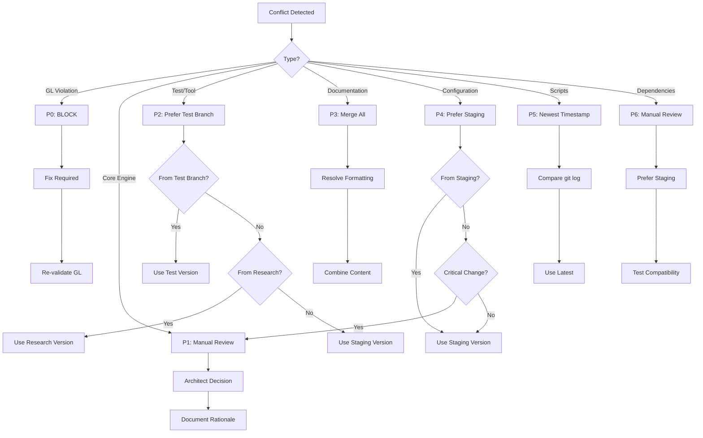

# @GL-governed
# @GL-layer: GL90-99
# @GL-semantic: documentation
# @GL-audit-trail: ../../engine/governance/GL_SEMANTIC_ANCHOR.json
#
# GL Unified Charter Activated
# @GL-governed
# @GL-layer: GL90-99
# @GL-semantic: documentation
# @GL-audit-trail: ../../engine/governance/GL_SEMANTIC_ANCHOR.json
#
# GL Unified Charter Activated
# ADR-005: Conflict Resolution Priority Matrix

## Status
**Proposed**

## Context

When integrating three branches (staging, test/template-branch, research/template-branch), merge conflicts are inevitable. Without a clear conflict resolution strategy, integration becomes inconsistent, time-consuming, and error-prone.

### Problem
Conflicts arise in multiple areas:
- Core engine code changes
- Configuration file updates
- Documentation improvements
- Test suite modifications
- GL governance artifacts
- Tooling and scripts

Without clear priorities, each conflict requires ad-hoc decisions, leading to:
- Inconsistent resolution approaches
- Extended decision time
- Potential loss of important changes
- Risk of breaking changes
- Team disagreements

### Requirements
- Clear, consistent conflict resolution rules
- Preservation of GL governance integrity
- Minimize risk of breaking changes
- Leverage production validation from staging
- Maintain comprehensive documentation
- Preserve test improvements

## Decision

**We will apply a priority-based conflict resolution matrix with the following rules:**

### Priority Matrix

| Priority | Conflict Type | Resolution Strategy | Rationale |
|----------|--------------|--------------------|-----------| 
| **P0** | GL Semantic Violations | Block integration - must fix | Non-negotiable governance requirement |
| **P1** | Core Engine Code | Manual review + architectural decision | Stability critical, needs expert review |
| **P2** | Test/Tooling Code | Prefer test branch → research → staging | Test improvements prioritized |
| **P3** | Documentation | Merge all, resolve formatting conflicts | Preserve all documentation |
| **P4** | Configuration | Prefer staging → test → research | Production-validated configs preferred |
| **P5** | Scripts/Automation | Prefer newest timestamp | Latest improvements win |
| **P6** | Dependencies | Manual review, prefer staging | Production stability critical |

### Resolution Decision Tree



## Detailed Resolution Rules

### P0: GL Semantic Violations (CRITICAL)

**Detection**:
```bash
python scripts/gl/validate-semantics.py
```

**Resolution**:
- ❌ **NEVER** automatically resolve GL violations
- ⚠️ **ALWAYS** block integration until fixed
- 📝 **ALWAYS** document the violation and fix
- ✅ **ALWAYS** re-validate after fix

**Examples**:
- Semantic boundary violations between GL layers
- Artifact matrix structural changes
- DAG topology modifications
- Filesystem mapping violations

**Action**:
```bash
# Block and report
echo "❌ CRITICAL: GL Semantic Violation Detected"
echo "Integration blocked - manual fix required"
python scripts/gl/validate-semantics.py --verbose
exit 1
```

### P1: Core Engine Code (HIGH PRIORITY)

**Affected Areas**:
- `engine/loader/`, `engine/parser/`, `engine/validator/`
- `engine/normalizer/`, `engine/executor/`, `engine/renderer/`
- `engine/gl-gate/`, `engine/governance/`

**Resolution**:
1. Identify nature of conflict (feature vs bug fix vs refactor)
2. Consult Senior Architect for decision
3. Prefer changes with tests
4. Document decision rationale
5. Validate with full test suite

**Decision Criteria**:
```yaml
criteria:
  - has_tests: +3 points
  - from_staging: +2 points (production validated)
  - from_test: +2 points (test coverage improved)
  - from_research: +1 point (innovative)
  - has_documentation: +1 point
  - breaking_change: -5 points
  - complexity_increase: -2 points
```

**Action**:
```bash
# Manual review required
echo "⚠️  P1 Conflict: Core Engine Code"
echo "File: $CONFLICT_FILE"
echo "Requesting architect review..."
# Pause for manual decision
```

### P2: Test/Tooling Code (MEDIUM PRIORITY)

**Affected Areas**:
- `tests/`, `engine/tests/`
- `scripts/gl/`, `tools/`
- Test utilities and frameworks

**Resolution Priority**:
1. **First**: test/template-branch (test improvements)
2. **Second**: research/template-branch (experimental tests)
3. **Third**: staging (production tests)

**Rationale**: Test improvements should be prioritized to increase coverage and quality

**Action**:
```bash
# Prefer test branch
if [ "$SOURCE_BRANCH" == "test/template-branch" ]; then
  git checkout --theirs "$CONFLICT_FILE"
  echo "✅ Using test branch version (test improvements preferred)"
fi
```

### P3: Documentation (LOW PRIORITY)

**Affected Areas**:
- `*.md` files
- `docs/` directory
- Inline code documentation
- README files

**Resolution**:
- Merge all content from all branches
- Resolve formatting conflicts
- Combine unique information
- Remove duplicates
- Fix markdown linting errors

**Action**:
```bash
# Merge documentation
echo "📝 P3 Conflict: Documentation"
echo "Merging all documentation changes..."
# Use 3-way merge or manual combination
git merge-file --theirs --ours "$CONFLICT_FILE"
# Manual review to combine content
```

### P4: Configuration Files (MEDIUM PRIORITY)

**Affected Areas**:
- `*.yaml`, `*.json`, `*.toml`
- `package.json`, `tsconfig.json`
- Environment configurations

**Resolution Priority**:
1. **First**: staging (production-validated)
2. **Second**: test (test-validated)
3. **Third**: research (experimental)

**Exception**: If configuration change is critical to a feature, escalate to P1

**Action**:
```bash
# Prefer staging configuration
if [ "$SOURCE_BRANCH" == "staging" ]; then
  git checkout --theirs "$CONFLICT_FILE"
  echo "✅ Using staging version (production-validated)"
else
  echo "⚠️  Review required: Configuration conflict"
fi
```

### P5: Scripts/Automation (LOW PRIORITY)

**Affected Areas**:
- Shell scripts
- Automation tools
- Build scripts
- CI/CD configurations

**Resolution**:
- Use the version with the latest commit timestamp
- Assumption: Latest version has most improvements

**Action**:
```bash
# Find newest version
STAGING_DATE=$(git log -1 --format=%ct staging -- "$CONFLICT_FILE")
TEST_DATE=$(git log -1 --format=%ct test/template-branch -- "$CONFLICT_FILE")
RESEARCH_DATE=$(git log -1 --format=%ct research/template-branch -- "$CONFLICT_FILE")

NEWEST=$(echo -e "$STAGING_DATE\n$TEST_DATE\n$RESEARCH_DATE" | sort -rn | head -1)

if [ "$NEWEST" == "$STAGING_DATE" ]; then
  git checkout staging -- "$CONFLICT_FILE"
elif [ "$NEWEST" == "$TEST_DATE" ]; then
  git checkout test/template-branch -- "$CONFLICT_FILE"
else
  git checkout research/template-branch -- "$CONFLICT_FILE"
fi

echo "✅ Using newest version based on timestamp"
```

### P6: Dependencies (MEDIUM PRIORITY)

**Affected Areas**:
- `package.json`, `package-lock.json`
- `requirements.txt`
- Dependency version specifications

**Resolution**:
- Prefer staging versions (production-tested)
- Manual review for version conflicts
- Test compatibility thoroughly
- Update lockfiles after resolution

**Action**:
```bash
# Manual review for dependencies
echo "⚠️  P6 Conflict: Dependencies"
echo "Preferring staging version..."
git checkout staging -- "$CONFLICT_FILE"
echo "Running compatibility tests..."
npm install && npm test
```

## Conflict Resolution Workflow

### Step-by-Step Process

```bash
#!/bin/bash
# conflict-resolver.sh

resolve_conflict() {
  CONFLICT_FILE=$1
  
  # Determine conflict type
  if [[ $CONFLICT_FILE == gl/* ]] || [[ $CONFLICT_FILE == *governance* ]]; then
    # P0: GL Violation
    echo "❌ P0: GL Semantic Violation - BLOCKING"
    exit 1
    
  elif [[ $CONFLICT_FILE == engine/*/src/* ]]; then
    # P1: Core Engine
    echo "⚠️  P1: Core Engine Conflict - Manual Review Required"
    # Pause for manual decision
    return 1
    
  elif [[ $CONFLICT_FILE == *test* ]] || [[ $CONFLICT_FILE == tools/* ]]; then
    # P2: Test/Tooling
    echo "📋 P2: Test/Tooling - Preferring test branch"
    git checkout test/template-branch -- "$CONFLICT_FILE"
    
  elif [[ $CONFLICT_FILE == *.md ]]; then
    # P3: Documentation
    echo "📝 P3: Documentation - Merging all content"
    # Manual merge required
    return 2
    
  elif [[ $CONFLICT_FILE == *.yaml ]] || [[ $CONFLICT_FILE == *.json ]]; then
    # P4: Configuration
    echo "⚙️  P4: Configuration - Preferring staging"
    git checkout staging -- "$CONFLICT_FILE"
    
  elif [[ $CONFLICT_FILE == *.sh ]] || [[ $CONFLICT_FILE == scripts/* ]]; then
    # P5: Scripts
    echo "🔧 P5: Scripts - Using newest version"
    # Use timestamp logic (see P5 above)
    
  elif [[ $CONFLICT_FILE == package*.json ]] || [[ $CONFLICT_FILE == requirements.txt ]]; then
    # P6: Dependencies
    echo "📦 P6: Dependencies - Manual review + prefer staging"
    git checkout staging -- "$CONFLICT_FILE"
    return 3
  fi
  
  return 0
}
```

## Alternatives Considered

### Alternative 1: Always Prefer Staging
| Pros | Cons | Why Not Chosen |
|------|------|----------------|
| Simple rule | Loses test improvements | Misses valuable changes |
| Production-validated | Loses research innovations | Incomplete integration |
| Fast resolution | May ignore better solutions | Poor utilization of branches |

### Alternative 2: Always Manual Review
| Pros | Cons | Why Not Chosen |
|------|------|----------------|
| Perfect decisions | Extremely time-consuming | Not scalable |
| No automation risk | Requires experts always available | Resource intensive |
| Context-aware | Inconsistent if different reviewers | Slow progress |

### Alternative 3: Automated AI Resolution
| Pros | Cons | Why Not Chosen |
|------|------|----------------|
| Fast | May make poor decisions | Too risky for critical code |
| Scalable | Hard to explain rationale | Immature technology |
| Learning over time | Requires training data | Not ready for production |

## Consequences

### Positive
- ✅ **Consistency**: Same types of conflicts resolved the same way
- ✅ **Speed**: Clear rules reduce decision time
- ✅ **Preservation**: Important changes from all branches retained
- ✅ **Safety**: Production-validated configs and dependencies preferred
- ✅ **Quality**: Test improvements prioritized
- ✅ **Documentation**: All documentation preserved and combined
- ✅ **Transparency**: Clear decision rationale
- ✅ **Scalability**: Works for any number of similar integrations

### Negative
- ⚠️ **Inflexibility**: Rules may not fit every scenario
- ⚠️ **Loss of Context**: Automated rules miss nuances
- ⚠️ **Potential Regressions**: Newest != best
- ⚠️ **Manual Overhead**: P1 and P6 still require manual review

### Mitigation
- Document exceptions when rules don't apply
- Allow manual override with required justification
- Review and refine rules based on experience
- Maintain audit trail of all conflict resolutions

## GL Governance Impact

### Compliance
- **GL00-09 Strategic**: Low impact, documentation preserved
- **GL10-29 Operational**: Medium impact, policy validation required
- **GL30-49 Execution**: High impact, core engine conflicts need review
- **GL50-59 Observability**: Medium impact, monitoring configs validated
- **GL60-80 Feedback**: Low impact, standard merge rules apply
- **GL81-83 Extended**: Low impact, external integrations reviewed
- **GL90-99 Meta**: Critical impact, P0 violations block integration

### Validation
After conflict resolution:
```bash
# Validate resolution didn't break GL compliance
python scripts/gl/validate-semantics.py
python scripts/gl/quantum-validate.py
make test
npm run check:gl-compliance
```

## Success Metrics

### Resolution Metrics
- Average conflict resolution time: <5 minutes (automated), <30 minutes (manual)
- Conflicts requiring escalation: <10%
- Post-resolution validation failures: <5%
- Developer satisfaction with process: >4/5

### Quality Metrics
- Regressions introduced: 0
- Important features lost: 0
- GL violations from conflict resolution: 0
- Documentation completeness: 100%

## Documentation Requirements

### For Each Conflict Resolution
Document:
- File path and conflict type
- Resolution priority level (P0-P6)
- Resolution strategy applied
- Branch source chosen
- Rationale for decision
- Validation results

### Conflict Resolution Log
```markdown
## Conflict Resolution Log

### Conflict #1
- **File**: `engine/loader/src/config-loader.ts`
- **Type**: Core Engine Code
- **Priority**: P1 (Manual Review)
- **Resolution**: Used staging version with test improvements merged
- **Rationale**: Staging version production-tested, test improvements cherry-picked
- **Validation**: ✅ All tests pass, GL compliance maintained

### Conflict #2
- **File**: `docs/readme.md`
- **Type**: Documentation
- **Priority**: P3 (Merge All)
- **Resolution**: Combined content from all branches
- **Rationale**: Preserve all documentation improvements
- **Validation**: ✅ Markdown lint passed
```

## Review and Approval

### Stakeholders
- Senior Architect (Author)
- Development Team Lead
- GL Governance Team
- DevOps Team

### Approval Status
- [ ] Technical Review
- [ ] GL Governance Review
- [ ] Developer Team Review
- [ ] Final Approval

## Related Documentation

- [Multi-Branch Integration Architecture](../architecture/multi_branch_integration_Architecture.md)
- [ADR-003: Sequential Integration Strategy](ADR-003-sequential-integration-strategy.md)
- [ADR-004: GL-First Validation Approach](ADR-004-gl-first-validation.md)
- [Branch Strategy Guide](../../BRANCH_STRATEGY.md)

---

**Date**: 2026-01-27  
**Author**: Senior Architect Agent  
**GL Layer**: GL10-29 Operational Layer  
**Status**: Proposed → Review Required  
**Next Review**: Before integration starts
