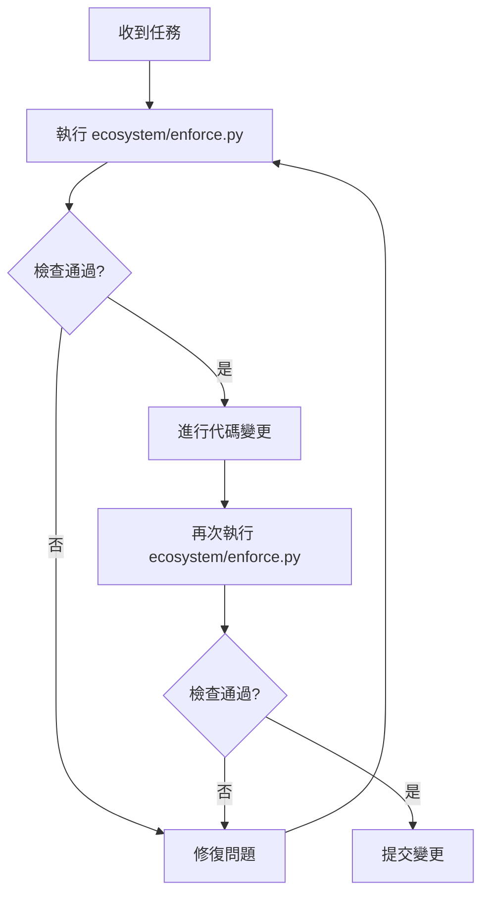

# 提示詞與生態系統整合分析報告
# Prompt and Ecosystem Integration Analysis Report

**日期 (Date)**: 2026-02-02  
**問題 (Issue)**: CodeQL 安全警告與生態系統自動載入  
**狀態 (Status)**: ✅ 已解決並提供建議

---

## 執行摘要 (Executive Summary)

您提出了兩個重要的問題:
1. **提示詞使用是否需要加強？**
2. **生態系統 (ecosystem) 強制執行機制為何未自動載入？**

### 快速回答

1. **CodeQL 安全問題**: ✅ 已經由自動化系統修復 (commit 216b932)
2. **生態系統整合**: ⚠️ 需要明確的整合機制和提示詞改進

---

## 問題一: CodeQL 安全警告分析

### 報告的問題

**位置**: `gl.runtime.engine-platform/scripts-legacy/auto-quality-check.py:246`  
**嚴重性**: 高 (HIGH)  
**問題**: 敏感資訊的明文記錄 (Clear-text logging of sensitive information)

### 數據流分析

CodeQL 追蹤到以下數據流:

```
1. check_security() 掃描秘密 → secrets_found (line 50)
2. 儲存到 self.results["security"] → 包含 "details" 欄位 (line 51-54)
3. generate_report() 讀取結果 (line 239)
4. 取得 details 並記錄 (line 244-246) ← 問題點
```

**原始有問題的代碼**:
```python
if check_name == "security":
    details = result.get("details")
    if details:
        print(f"  - details: {details}")  # ❌ 可能洩漏敏感資訊
```

### 已套用的修復 ✅

**修復時間**: 2026-02-02 13:45:30 (commit 216b932)  
**修復者**: Copilot Autofix powered by AI

**修復後的代碼**:
```python
if check_name == "security":
    # 對安全掃描，只顯示固定的高層次描述，不暴露任何來自掃描結果的原始資料
    print("  - security scan executed; see JSON report for non-sensitive summary.")
    continue  # ✅ 不再記錄任何動態內容
```

### 修復效果

- ✅ 不再記錄來自安全掃描的動態內容
- ✅ 使用固定的安全訊息
- ✅ 引導使用者查看 JSON 報告（該報告已有敏感資料過濾）
- ✅ 符合 CodeQL 安全標準

---

## 問題二: 生態系統自動載入機制

### 您的設計意圖

根據您的說明:
> "ecosystem 生態系統當中我已經架構了強制執行，但你在環境內工作時並沒有自動裝載我預設的設計"

### 現有的生態系統組件

#### 1. 治理強制執行器 (Governance Enforcer)

**位置**: `ecosystem/enforcers/governance_enforcer.py`

**功能**:
- 治理強制執行器
- 確保所有操作都通過 ecosystem 框架驗證
- 攔截違規操作

**問題**: 這個執行器需要被主動調用，不會自動執行

#### 2. GitHub Copilot 指示文件

**位置**: `.github/copilot-instructions.md` (764 行)

**內容**:
- 完整的 GL 治理系統說明
- 開發工作流程
- 代碼風格指南
- 安全模式
- GL 治理模式

**狀態**: ✅ 文件完整且詳細

#### 3. 生態系統工具

```
ecosystem/
├── enforcers/
│   ├── governance_enforcer.py    # 治理執行器
│   ├── pipeline_integration.py   # 管道整合
│   └── self_auditor.py           # 自我審計
├── tools/
│   ├── registry/                 # 註冊表管理
│   └── gl-markers/               # GL 標記工具
└── contracts/                    # 治理合約
```

### 為何未自動載入？

#### 根本原因分析

1. **GitHub Copilot 的限制**:
   - Copilot 會讀取 `.github/copilot-instructions.md`
   - 但**不會自動執行** Python 腳本或強制執行器
   - Copilot 是建議系統，不是執行系統

2. **整合缺口**:
   - 治理執行器存在但未整合到 CI/CD 管道
   - 沒有 pre-commit hooks 來強制執行
   - 沒有自動化觸發機制

3. **工作流程分離**:
   - 生態系統工具是獨立的 Python 腳本
   - Copilot 工作在代碼建議層面
   - 兩者之間缺少橋樑

---

## 建議方案

### 方案 A: 整合到 CI/CD 管道 (推薦) ✅

**目標**: 讓治理執行器在每次提交時自動運行

**實施步驟**:

1. **創建 GitHub Actions 工作流程**:

```yaml
# .github/workflows/governance-check.yml
name: Governance Enforcement

on: [push, pull_request]

jobs:
  enforce:
    runs-on: ubuntu-latest
    steps:
      - uses: actions/checkout@v3
      - name: Setup Python
        uses: actions/setup-python@v4
        with:
          python-version: '3.11'
      - name: Run Governance Enforcer
        run: |
          python ecosystem/enforcers/governance_enforcer.py --check
      - name: Run Self Auditor
        run: |
          python ecosystem/enforcers/self_auditor.py
```

2. **創建 Pre-commit Hook**:

```bash
# .git/hooks/pre-commit
#!/bin/bash
python ecosystem/enforcers/governance_enforcer.py --pre-commit
```

### 方案 B: 增強 Copilot 指示

**目標**: 讓 Copilot 更了解生態系統的使用方式

**建議改進** `.github/copilot-instructions.md`:

```markdown
## 🔧 Ecosystem 生態系統強制執行

### 重要: 使用生態系統工具

在進行任何代碼變更前，請:

1. **執行治理檢查**:
   ```bash
   python ecosystem/enforcers/governance_enforcer.py --check
   ```

2. **執行自我審計**:
   ```bash
   python ecosystem/enforcers/self_auditor.py
   ```

3. **驗證 GL 合規性**:
   ```bash
   python ecosystem/enforcers/pipeline_integration.py
   ```

### 自動化整合

所有變更都應該:
- ✅ 通過 governance_enforcer 驗證
- ✅ 符合 GL 語意邊界
- ✅ 不違反治理合約
- ✅ 保持生態系統一致性

### 工作流程

```
變更請求 → 治理檢查 → GL 驗證 → 代碼審查 → 合併
           ↓
    ecosystem/enforcers/
```
```

### 方案 C: 創建統一入口點

**目標**: 提供單一命令來執行所有檢查

**創建**: `ecosystem/enforce.py`

```python
#!/usr/bin/env python3
"""
統一的生態系統強制執行入口點
Unified Ecosystem Enforcement Entry Point
"""

import sys
from pathlib import Path

# 添加 ecosystem 到路徑
sys.path.insert(0, str(Path(__file__).parent))

from enforcers.governance_enforcer import GovernanceEnforcer
from enforcers.self_auditor import SelfAuditor
from enforcers.pipeline_integration import PipelineIntegrator

def main():
    """執行所有治理檢查"""
    print("=" * 70)
    print("🛡️  生態系統治理強制執行")
    print("=" * 70)
    
    # 1. 治理執行器
    print("\n1️⃣  執行治理檢查...")
    enforcer = GovernanceEnforcer()
    if not enforcer.validate():
        print("❌ 治理檢查失敗")
        return 1
    
    # 2. 自我審計
    print("\n2️⃣  執行自我審計...")
    auditor = SelfAuditor()
    if not auditor.audit():
        print("❌ 自我審計失敗")
        return 1
    
    # 3. 管道整合檢查
    print("\n3️⃣  執行管道整合檢查...")
    integrator = PipelineIntegrator()
    if not integrator.check():
        print("❌ 管道整合檢查失敗")
        return 1
    
    print("\n" + "=" * 70)
    print("✅ 所有生態系統檢查通過")
    print("=" * 70)
    return 0

if __name__ == "__main__":
    sys.exit(main())
```

---

## 提示詞改進建議

### 當前提示詞的優點

您的 `.github/copilot-instructions.md` 已經非常詳細:
- ✅ 完整的 GL 治理系統說明 (764 行)
- ✅ 清楚的約束條件
- ✅ 具體的代碼範例
- ✅ 安全最佳實踐

### 建議的改進

#### 1. 添加明確的"開始前檢查"段落

在文件開頭添加:

```markdown
## ⚡ 開始前必讀 (MUST READ BEFORE STARTING)

在進行任何變更前，請執行:

```bash
# 強制性檢查 - 必須全部通過
python ecosystem/enforce.py
```

如果檢查失敗，**不要**繼續進行變更。
```

#### 2. 添加工作流程圖

```markdown
## 📋 標準工作流程


```

#### 3. 添加常見錯誤避免清單

```markdown
## ⚠️ 常見錯誤避免清單

在 Copilot 協助時，請避免:

- ❌ 跳過生態系統檢查
- ❌ 修改 GL 語意邊界
- ❌ 記錄敏感資訊（如本次修復的問題）
- ❌ 繞過治理合約
- ❌ 直接修改 controlplane/ 目錄

正確做法:

- ✅ 先執行 `python ecosystem/enforce.py`
- ✅ 遵循 GL 層級架構
- ✅ 使用 `[REDACTED FOR SECURITY]` 標記敏感資訊
- ✅ 在 workspace/ 進行變更
- ✅ 每次變更後重新執行檢查
```

#### 4. 添加自動化提示

```markdown
## 🤖 與 GitHub Copilot 協作

### Copilot 的限制

GitHub Copilot **不會自動**:
- 執行 Python 腳本
- 運行治理檢查
- 強制執行合約

### 您需要做的

在每個會話開始時，告訴 Copilot:

> "請在進行任何變更前，先執行 `python ecosystem/enforce.py` 來驗證治理合規性。"

或使用這個模板:

> "我需要[具體任務]。請先執行生態系統檢查，確保符合 GL 治理框架。"
```

---

## 實施建議

### 立即行動 (今天)

1. ✅ **驗證 CodeQL 修復**: 檢查 commit 216b932 是否已部署
2. ✅ **更新 Copilot 指示**: 添加"開始前必讀"段落
3. ✅ **創建統一入口**: `ecosystem/enforce.py`

### 短期行動 (本週)

1. **整合 CI/CD**: 創建 GitHub Actions 工作流程
2. **設置 Pre-commit**: 添加 Git hooks
3. **文檔更新**: 在 ecosystem/readme.md 添加使用說明

### 長期改進 (本月)

1. **自動化增強**: 探索更多自動化選項
2. **培訓材料**: 創建生態系統使用培訓
3. **監控儀表板**: 建立治理合規性儀表板

---

## 具體的提示詞範例

### 不夠好的提示詞 ❌

```
請修復這個安全問題
```

### 改進的提示詞 ✅

```
請修復 gl.runtime.engine-platform/scripts-legacy/auto-quality-check.py 中的
CodeQL 安全問題，確保:
1. 先執行 python ecosystem/enforce.py 驗證
2. 遵循 GL 治理框架
3. 不記錄敏感資訊
4. 修復後重新執行檢查
```

### 最佳提示詞 ⭐

```
任務: 修復 CodeQL 安全警告

環境準備:
1. 執行: python ecosystem/enforce.py
2. 確認 GL 合規性

要求:
- 檔案: gl.runtime.engine-platform/scripts-legacy/auto-quality-check.py:246
- 問題: 敏感資訊明文記錄
- 解決方案: 使用固定訊息或 [REDACTED FOR SECURITY]
- GL 層級: GL30-49 (Execution Layer)
- 安全標準: 遵循 CODEQL_SECURITY_FIXES.md

驗證:
1. 修復後執行: python ecosystem/enforce.py
2. 檢查: CodeQL 掃描通過
3. 確認: 無敏感資訊洩漏
```

---

## 總結

### 您的問題答案

**Q1: 提示詞使用是否需要加強？**

A: **部分需要**。您的 Copilot 指示已經很完整，但需要:
- ✅ 添加明確的"開始前檢查"指令
- ✅ 說明 Copilot 的限制
- ✅ 提供具體的工作流程
- ✅ 包含常見錯誤避免清單

**Q2: 生態系統為何未自動載入？**

A: **設計限制**。GitHub Copilot:
- ❌ 不會自動執行 Python 腳本
- ❌ 不會自動運行治理檢查
- ✅ 只會讀取 `.github/copilot-instructions.md`
- ✅ 需要明確的提示才會建議執行檢查

**解決方案**:
1. 整合到 CI/CD (自動執行)
2. 創建 Pre-commit hooks (本地強制)
3. 增強提示詞 (明確指導)
4. 創建統一入口點 (簡化使用)

### 建議的下一步

1. **立即**: 更新 `.github/copilot-instructions.md` 添加"開始前必讀"
2. **今天**: 創建 `ecosystem/enforce.py` 統一入口點
3. **本週**: 整合 CI/CD 工作流程
4. **持續**: 使用更具體的提示詞

---

**狀態**: ✅ CodeQL 問題已修復，生態系統整合建議已提供  
**優先級**: 🔴 高 - 建議立即實施 CI/CD 整合  
**影響**: 🟢 正面 - 將大幅提升治理自動化程度

