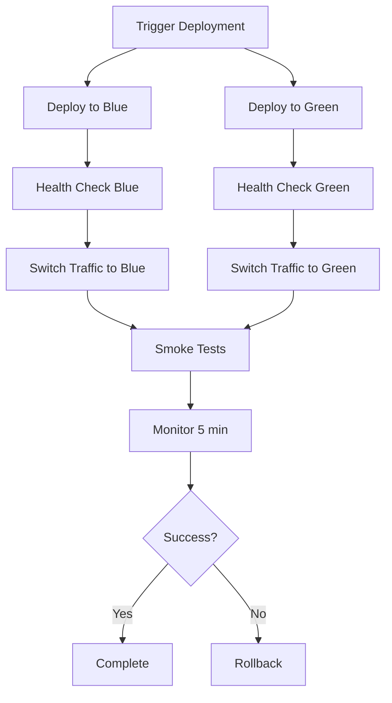

# GL Unified Charter Activated
# CI/CD Pipeline Guide

## Overview

This document provides comprehensive guidance on the CI/CD pipeline implementation for MachineNativeOps. The pipeline includes automated testing, linting, building, security scanning, and deployment to staging and production environments with blue-green deployment strategy.

## Table of Contents

1. [Architecture](#architecture)
2. [Workflows](#workflows)
3. [Prerequisites](#prerequisites)
4. [Setup Instructions](#setup-instructions)
5. [Deployment Process](#deployment-process)
6. [Rollback Procedures](#rollback-procedures)
7. [Monitoring and Troubleshooting](#monitoring-and-troubleshooting)
8. [Best Practices](#best-practices)

---

## Architecture

### Pipeline Components

The CI/CD pipeline consists of the following main components:

```
┌─────────────────────────────────────────────────────────────┐
│                     GitHub Repository                        │
│  ┌──────────────────────────────────────────────────────┐  │
│  │           GitHub Actions Workflows                    │  │
│  │  ┌──────────┐  ┌──────────┐  ┌──────────┐           │  │
│  │  │    CI    │  │Security  │  │Dependency│           │  │
│  │  │  Workflow│  │  Scanning│  │  Check   │           │  │
│  │  └──────────┘  └──────────┘  └──────────┘           │  │
│  └──────────────────────────────────────────────────────┘  │
│                           │                                 │
│                           ▼                                 │
│  ┌──────────────────────────────────────────────────────┐  │
│  │              Deployment Workflows                     │  │
│  │  ┌──────────────┐  ┌──────────────────────────────┐  │  │
│  │  │   Staging    │  │      Production              │  │  │
│  │  │  Deployment  │  │  Blue-Green Deployment       │  │  │
│  │  └──────────────┘  │  ┌──────────┐  ┌──────────┐  │  │  │
│  │                   │  │   Blue   │  │  Green   │  │  │  │
│  │                   │  └──────────┘  └──────────┘  │  │  │
│  │                   └──────────────────────────────┘  │  │
│  └──────────────────────────────────────────────────────┘  │
└─────────────────────────────────────────────────────────────┘
```

### Environments

- **Development**: Local development environment
- **Staging**: Pre-production testing environment
- **Production-Blue**: Production environment (active)
- **Production-Green**: Production environment (standby)

---

## Workflows

### 1. CI Workflow (`.github/workflows/ci.yml`)

**Triggers:**
- Push to `main` or `develop` branches
- Pull requests to `main` or `develop`

**Jobs:**
1. **Lint**: Code quality checks using ESLint and Pylint
2. **Test**: Automated testing with coverage reporting
3. **Build**: Build artifacts generation
4. **Security Scan**: Vulnerability scanning with Trivy and CodeQL
5. **Dependency Check**: Security audit of dependencies

**Example Output:**
```yaml
✓ ESLint passed
✓ Pylint passed
✓ Tests passed (85% coverage)
✓ Build completed
✓ Security scan: 0 vulnerabilities
✓ Dependencies: 1 moderate issue
```

### 2. Staging Deployment Workflow (`.github/workflows/deploy-staging.yml`)

**Triggers:**
- Push to `develop` branch
- Manual workflow dispatch

**Steps:**
1. Build application
2. Configure deployment credentials
3. Deploy to staging server
4. Run database migrations
5. Health checks
6. Notify deployment status

### 3. Production Deployment Workflow (`.github/workflows/deploy-production.yml`)

**Triggers:**
- Push to `main` branch
- Manual workflow dispatch with options

**Jobs:**
1. **Pre-deployment Checks**: Verify staging deployment
2. **Deploy Blue/Green**: Deploy to production environment
3. **Switch Traffic**: Route traffic to new deployment
4. **Rollback**: Automatic rollback on failure
5. **Post-deploy**: Cleanup and monitoring updates

**Blue-Green Strategy:**
```
[Load Balancer] ──┬──► [Blue Environment] (Port 3001)
                  │
                  └──► [Green Environment] (Port 3002)
```

### 4. Security Scanning Workflow (`.github/workflows/security-scan.yml`)

**Triggers:**
- Push to `main` or `develop`
- Pull requests
- Daily schedule (2 AM UTC)
- Manual dispatch

**Scans:**
- SAST (Static Application Security Testing)
- Dependency vulnerability scanning
- Container image scanning
- CodeQL analysis
- Secret scanning

### 5. Dependency Check Workflow (`.github/workflows/dependency-check.yml`)

**Triggers:**
- Push to `main` or `develop`
- Pull requests
- Daily schedule (3 AM UTC)
- Manual dispatch

**Checks:**
- NPM audit
- Python safety check
- License compliance
- Outdated packages
- SBOM generation

---

## Prerequisites

### Required Secrets

Configure the following secrets in your GitHub repository settings:

#### AWS Credentials (if using AWS)
```bash
AWS_ACCESS_KEY_ID=your-access-key
AWS_SECRET_ACCESS_KEY=your-secret-key
AWS_REGION=us-east-1
```

#### Container Registry (if using Docker)
```bash
REGISTRY=docker.io/your-registry
REGISTRY_USERNAME=your-username
REGISTRY_PASSWORD=your-password
```

#### Security Tools
```bash
SNYK_TOKEN=your-snyk-token
```

#### Notifications
```bash
SLACK_WEBHOOK=https://hooks.slack.com/services/YOUR/WEBHOOK/URL
```

#### Server Access
```bash
SSH_PRIVATE_KEY=your-private-key
STAGING_SERVER=staging.example.com
PRODUCTION_SERVER=production.example.com
```

### Self-Hosted Server Requirements

**Minimum Specifications:**
- CPU: 2 cores
- RAM: 4 GB
- Storage: 20 GB
- OS: Ubuntu 22.04 LTS or similar

**Required Software:**
- Node.js 20.x
- Python 3.11
- Docker (optional)
- Nginx (for load balancing)
- Git

---

## Setup Instructions

### 1. Initial Repository Setup

```bash
# Clone the repository
git clone https://github.com/MachineNativeOps/machine-native-ops.git
cd machine-native-ops

# Install dependencies
npm install

# Run tests
npm test
```

### 2. Configure GitHub Secrets

Navigate to: `Settings` → `Secrets and variables` → `Actions`

Add all required secrets listed in the Prerequisites section.

### 3. Server Setup

#### Install Dependencies on Production Server

```bash
# Update system
sudo apt update && sudo apt upgrade -y

# Install Node.js
curl -fsSL https://deb.nodesource.com/setup_20.x | sudo -E bash -
sudo apt install -y nodejs

# Install Python
sudo apt install -y python3.11 python3-pip

# Install Docker (optional)
curl -fsSL https://get.docker.com | sh
sudo usermod -aG docker $USER

# Install Nginx
sudo apt install -y nginx
```

#### Configure Deployment Directories

```bash
# Create deployment directories
sudo mkdir -p /var/www/blue
sudo mkdir -p /var/www/green
sudo mkdir -p /var/backups/blue
sudo mkdir -p /var/backups/green

# Set permissions
sudo chown -R $USER:$USER /var/www
sudo chown -R $USER:$USER /var/backups

# Create log directory
sudo mkdir -p /var/log
sudo touch /var/log/deployment.log
sudo chown $USER:$USER /var/log/deployment.log
```

#### Setup Systemd Services

Create `/etc/systemd/system/app-blue.service`:
```ini
[Unit]
Description=Application Blue Environment
After=network.target

[Service]
Type=simple
User=www-data
WorkingDirectory=/var/www/blue
ExecStart=/usr/bin/node server.js
Restart=always
RestartSec=10
Environment=NODE_ENV=production
Environment=PORT=3001

[Install]
WantedBy=multi-user.target
```

Create `/etc/systemd/system/app-green.service`:
```ini
[Unit]
Description=Application Green Environment
After=network.target

[Service]
Type=simple
User=www-data
WorkingDirectory=/var/www/green
ExecStart=/usr/bin/node server.js
Restart=always
RestartSec=10
Environment=NODE_ENV=production
Environment=PORT=3002

[Install]
WantedBy=multi-user.target
```

Enable services:
```bash
sudo systemctl daemon-reload
sudo systemctl enable app-blue app-green
```

#### Configure Nginx Load Balancer

Create `/etc/nginx/conf.d/load-balancer.conf`:
```nginx
upstream backend {
    server localhost:3001 max_fails=3 fail_timeout=30s;
    server localhost:3002 backup;
}

server {
    listen 80;
    server_name example.com;

    location / {
        proxy_pass http://backend;
        proxy_set_header Host $host;
        proxy_set_header X-Real-IP $remote_addr;
        proxy_set_header X-Forwarded-For $proxy_add_x_forwarded_for;
        proxy_set_header X-Forwarded-Proto $scheme;
    }

    location /health {
        access_log off;
        return 200 "healthy\n";
        add_header Content-Type text/plain;
    }
}
```

Restart Nginx:
```bash
sudo nginx -t
sudo systemctl restart nginx
```

### 4. Deploy Scripts Setup

Make scripts executable:
```bash
chmod +x scripts/*.sh
```

---

## Deployment Process

### Staging Deployment

**Automatic Deployment:**
1. Push changes to `develop` branch
2. CI workflow runs automatically
3. If CI passes, staging deployment triggers
4. Application deploys to staging server
5. Health checks verify deployment
6. Notification sent to Slack

**Manual Deployment:**
1. Go to GitHub Actions tab
2. Select "Deploy to Staging" workflow
3. Click "Run workflow"
4. Select branch (default: develop)
5. Click "Run workflow" button

### Production Deployment

#### Method 1: Automatic Deployment (Main Branch)

1. Push changes to `main` branch
2. CI workflow runs automatically
3. Staging deployment is verified
4. Production deployment triggers
5. Blue environment deploys first
6. Traffic switches to blue
7. Smoke tests run
8. Monitoring confirms success

#### Method 2: Manual Deployment with Blue-Green

1. Go to GitHub Actions tab
2. Select "Deploy to Production" workflow
3. Click "Run workflow"
4. Configure options:
   - `deploy_blue`: true/false
   - `deploy_green`: true/false
   - `rollback`: true/false
5. Click "Run workflow"

#### Blue-Green Deployment Flow:



---

## Rollback Procedures

### Automatic Rollback

The production deployment workflow includes automatic rollback if:
- Health checks fail
- Smoke tests fail
- Monitoring detects errors

### Manual Rollback

#### Option 1: Rollback to Previous Backup

```bash
# Execute rollback script
./scripts/rollback.sh previous
```

This will:
1. Stop current services
2. Restore from latest backup
3. Start services
4. Verify rollback
5. Notify monitoring system

#### Option 2: Rollback to Specific Commit

```bash
# Rollback to specific SHA
./scripts/rollback.sh abc123def456
```

This will:
1. Stop current services
2. Checkout specific commit
3. Redeploy application
4. Start services
5. Verify rollback

#### Option 3: Manual Traffic Switch

```bash
# Switch traffic back to previous environment
./scripts/switch-traffic.sh blue
# or
./scripts/switch-traffic.sh green
```

#### Option 4: GitHub Workflow Rollback

1. Go to GitHub Actions tab
2. Select "Deploy to Production" workflow
3. Click "Run workflow"
4. Set `rollback` to `true`
5. Click "Run workflow"

### Rollback Verification

After rollback, verify:
1. Services are running: `systemctl status app-blue app-green`
2. Health check passes: `curl https://example.com/health`
3. Application logs show no errors
4. User traffic is flowing normally

---

## Monitoring and Troubleshooting

### Monitoring Endpoints

Configure monitoring for these endpoints:

- **Health Check**: `https://example.com/health`
- **Metrics**: `https://example.com/metrics`
- **Status Page**: `https://example.com/status`

### Log Files

- **Application Logs**: `/var/log/app.log`
- **Deployment Logs**: `/var/log/deployment.log`
- **Nginx Logs**: `/var/log/nginx/access.log` and `/var/log/nginx/error.log`
- **System Logs**: `journalctl -u app-blue -f`

### Common Issues and Solutions

#### Issue: Deployment Fails

**Symptoms:**
- Workflow shows deployment failure
- Health checks fail

**Solutions:**
1. Check deployment logs: `tail -f /var/log/deployment.log`
2. Verify services are running: `systemctl status app-blue`
3. Check application logs: `journalctl -u app-blue -n 100`
4. Verify dependencies are installed: `npm list --production`

#### Issue: Health Check Timeout

**Symptoms:**
- Health check fails with timeout
- Application doesn't respond

**Solutions:**
1. Check if service is running: `systemctl status app-blue`
2. Check if port is listening: `netstat -tlnp | grep 3001`
3. Verify firewall rules: `sudo ufw status`
4. Check application startup errors: `journalctl -u app-blue -n 50`

#### Issue: Traffic Not Switching

**Symptoms:**
- Traffic not routing to new environment
- Old version still serving traffic

**Solutions:**
1. Check Nginx configuration: `sudo nginx -t`
2. Reload Nginx: `sudo systemctl reload nginx`
3. Verify upstream configuration: `cat /etc/nginx/conf.d/load-balancer.conf`
4. Check current environment: `cat /var/www/current-env`

#### Issue: Rollback Fails

**Symptoms:**
- Rollback script fails
- Services won't start after rollback

**Solutions:**
1. Check backup exists: `ls -la /var/backups/blue/`
2. Verify backup integrity: `ls -la /var/backups/blue/backup-*/`
3. Manual restore: `cp -r /var/backups/blue/backup-*/ /var/www/blue/`
4. Start services manually: `sudo systemctl start app-blue`

### Debug Mode

Enable debug logging in workflows:

1. Go to repository Settings
2. Navigate to Secrets and variables → Actions
3. Add new secret: `ACTIONS_STEP_DEBUG` = `true`
4. Re-run failed workflow

---

## Best Practices

### 1. Branch Strategy

- **main**: Production-ready code
- **develop**: Integration branch for features
- **feature/***: Feature branches
- **hotfix/***: Emergency fixes

### 2. Commit Messages

Follow conventional commits:
```
feat: add new feature
fix: resolve bug
docs: update documentation
chore: maintenance tasks
```

### 3. Testing

- Write unit tests for all new code
- Maintain 80%+ code coverage
- Run integration tests before merging
- Perform smoke tests after deployment

### 4. Security

- Regularly update dependencies
- Review security scan results
- Rotate secrets regularly
- Use dependency pinning

### 5. Deployment

- Deploy to staging before production
- Use feature flags for gradual rollout
- Monitor deployments closely
- Keep backups for quick rollback

### 6. Monitoring

- Set up alerts for critical errors
- Monitor performance metrics
- Track deployment success rate
- Review logs regularly

### 7. Documentation

- Update documentation with changes
- Document deployment procedures
- Keep runbooks up to date
- Share knowledge with team

---

## Quick Reference

### Essential Commands

```bash
# View workflow runs
gh run list --workflow=ci.yml

# Re-run failed workflow
gh run rerun <run-id>

# Trigger staging deployment
gh workflow run deploy-staging.yml

# Trigger production deployment
gh workflow run deploy-production.yml -f deploy_blue=true

# View deployment logs
gh run view <run-id> --log

# Check service status
ssh user@server "systemctl status app-blue"

# View application logs
ssh user@server "journalctl -u app-blue -f"

# Manual health check
curl https://example.com/health

# Manual rollback
ssh user@server "cd /var/www && ./scripts/rollback.sh previous"
```

### Workflow Files

- `ci.yml` - Main CI workflow
- `deploy-staging.yml` - Staging deployment
- `deploy-production.yml` - Production deployment with blue-green
- `security-scan.yml` - Security scanning
- `dependency-check.yml` - Dependency management

### Deployment Scripts

- `deploy-blue.sh` - Deploy to blue environment
- `deploy-green.sh` - Deploy to green environment
- `switch-traffic.sh` - Switch traffic between environments
- `rollback.sh` - Rollback to previous version
- `health-check.sh` - Health check endpoint
- `cleanup-old-deployments.sh` - Cleanup old deployment artifacts

---

## Support

For issues or questions:
1. Check the troubleshooting section
2. Review workflow logs in GitHub Actions
3. Check server logs
4. Open an issue in the repository

---

## Changelog

### Version 1.0.0 (2024-01-21)
- Initial CI/CD pipeline implementation
- Blue-green deployment strategy
- Automated testing and linting
- Security scanning and dependency checks
- Rollback capabilities
- Comprehensive documentation