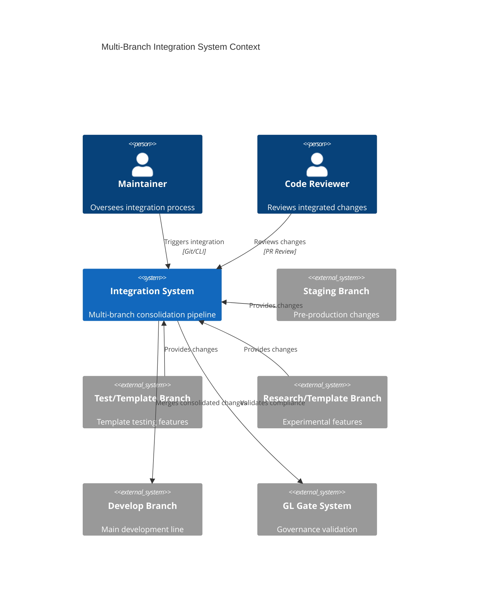
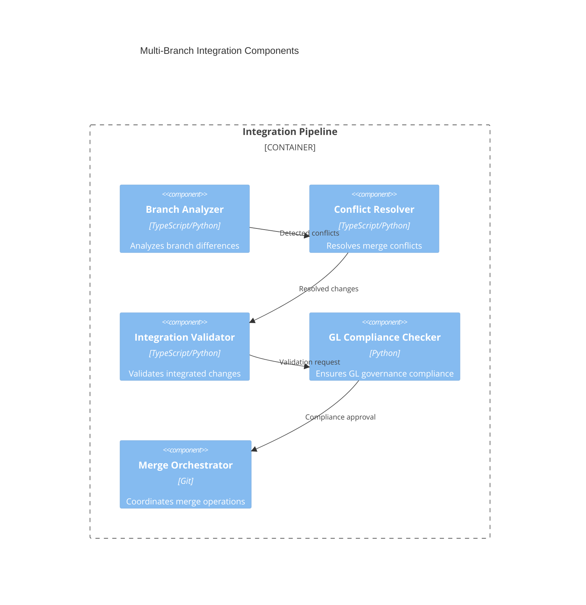
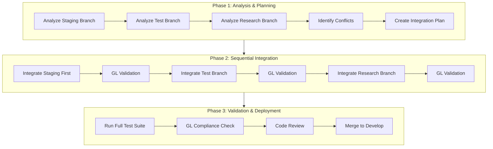
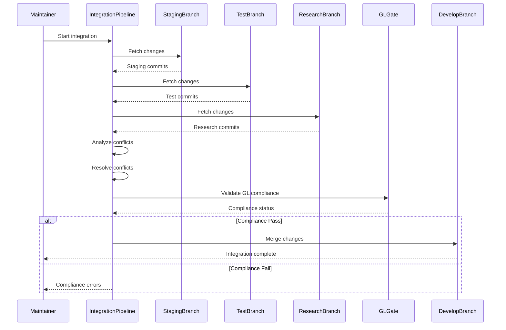
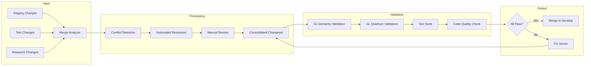
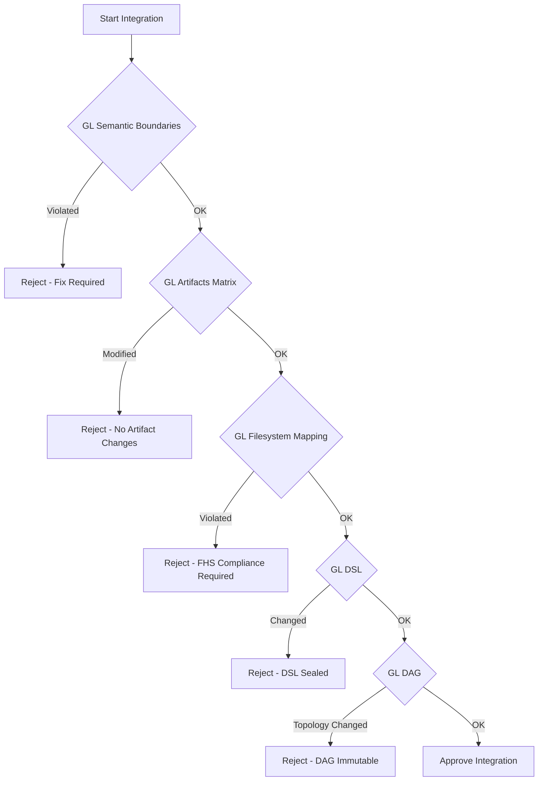
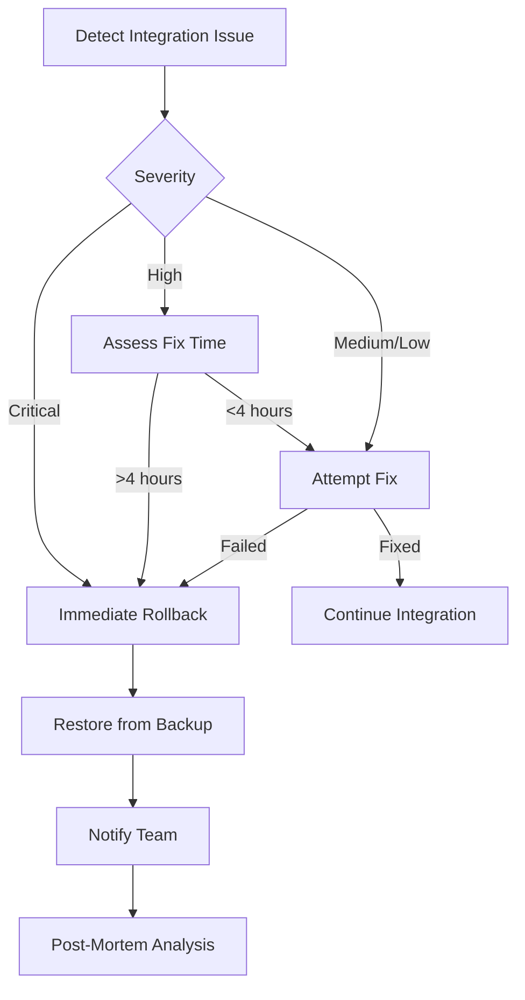

# Multi-Branch Integration Architecture

<!-- GL Layer: GL30-49 Execution Layer -->
<!-- Purpose: Define architecture for integrating multiple branches (staging, test/template-branch, research/template-branch) -->

## Executive Summary

This document defines the architecture for integrating changes from three primary branches into a unified codebase:
- **staging** - Pre-production changes
- **test/template-branch** - Template testing and validation features
- **research/template-branch** - Research and experimental features

The integration follows GL governance constraints and maintains semantic integrity while consolidating improvements from parallel development streams.

## Context & Problem Statement

### Context
The MachineNativeOps repository has evolved through parallel development streams:
1. **Staging Branch**: Pre-production changes awaiting final validation
2. **Test/Template Branch**: Template system testing and validation tools
3. **Research/Template Branch**: Experimental template-related research

These branches need to be integrated into the main development line while:
- Preserving GL governance boundaries (GL00-99)
- Maintaining semantic consistency
- Avoiding breaking changes to core architecture
- Ensuring all validation and compliance checks pass

### Problem Statement
Pull all files from the three branches and perform further integration/consolidation:
- https://github.com/Machine-Organization/machine-native-ops/compare/staging?expand=1
- https://github.com/Machine-Organization/machine-native-ops/compare/test/template-branch?expand=1
- https://github.com/Machine-Organization/machine-native-ops/compare/research/template-branch?expand=1

### Scope
- **In Scope**:
  - Architectural design for integration strategy
  - Conflict resolution patterns
  - GL governance compliance validation
  - Integration sequence and dependencies
  - Testing and validation approach
  
- **Out of Scope**:
  - Detailed code implementation (handled by development team)
  - Database schema changes (requires separate ADR)
  - Infrastructure changes (requires separate planning)

## System Context Diagram



## Component Diagram



## Integration Architecture

### Three-Phase Integration Strategy



## Integration Sequence Diagram



## Data Flow Diagram



## GL Governance Layer Mapping

### Integration Impact by GL Layer

| GL Layer | Impact | Validation Required | Risk Level |
|----------|--------|-------------------|------------|
| **GL00-09 Strategic** | Low - Strategic documents rarely changed | Basic review | Low |
| **GL10-29 Operational** | Medium - Process policies may be updated | Policy validation | Medium |
| **GL30-49 Execution** | High - Core engine and tools affected | Full validation | High |
| **GL50-59 Observability** | Medium - Monitoring and metrics updates | Metric consistency | Medium |
| **GL60-80 Feedback** | Low - Feedback mechanisms stable | Basic validation | Low |
| **GL81-83 Extended** | Low - External integrations minimal | Integration tests | Low |
| **GL90-99 Meta** | Critical - Semantic root must be preserved | Semantic validation | Critical |

### GL Compliance Checkpoints



## Architecture Decision Records

### ADR-003: Sequential Integration Strategy

**Status**: Proposed

**Context**: Three branches need to be integrated with potential conflicts and different maturity levels.

**Decision**: Integrate branches sequentially in order of maturity and impact:
1. Staging (highest maturity, most production-ready)
2. Test/Template (validated features, moderate risk)
3. Research/Template (experimental, highest risk)

**Rationale**:
- Staging changes are most stable and well-tested
- Early integration of stable changes provides a solid foundation
- Conflicts are easier to resolve incrementally
- Each integration can be validated before proceeding
- Experimental features integrated last minimizes risk

**Consequences**:
- **Positive**:
  - Reduced risk of breaking changes
  - Easier conflict identification and resolution
  - Progressive validation at each step
  - Clear rollback points
  
- **Negative**:
  - Longer integration timeline
  - Potential for duplicate conflict resolution
  - More validation cycles required

### ADR-004: GL-First Validation Approach

**Status**: Proposed

**Context**: Integration must maintain GL governance compliance throughout the process.

**Decision**: Validate GL compliance after each branch integration, not just at the end.

**Rationale**:
- Early detection of GL violations
- Prevents cascade of governance issues
- Maintains semantic integrity throughout process
- Aligns with GL governance philosophy

**Consequences**:
- **Positive**:
  - Higher confidence in final integration
  - Easier to identify source of GL violations
  - Maintains governance integrity
  
- **Negative**:
  - Additional validation overhead
  - Potentially slower integration process

### ADR-005: Conflict Resolution Priority Matrix

**Status**: Proposed

**Context**: Conflicts between branches need clear resolution rules.

**Decision**: Apply conflict resolution priorities:

| Priority | Type | Resolution Strategy |
|----------|------|-------------------|
| P0 | GL Semantic Violations | Block integration, fix required |
| P1 | Core Engine Changes | Manual review, architectural decision |
| P2 | Test/Tooling Conflicts | Prefer test branch changes |
| P3 | Documentation Conflicts | Merge all, resolve formatting |
| P4 | Configuration Conflicts | Prefer staging (production-validated) |

**Rationale**:
- Clear decision framework reduces ambiguity
- Prioritizes governance and core stability
- Leverages production validation from staging
- Preserves all documentation improvements

**Consequences**:
- **Positive**:
  - Consistent conflict resolution
  - Reduced decision time
  - Clear escalation path
  
- **Negative**:
  - May lose some experimental features
  - Requires good documentation of choices

## Integration Workflow

### Step-by-Step Integration Process

#### Phase 1: Pre-Integration Analysis (Days 1-2)

```bash
# 1. Fetch all remote branches
git fetch --all

# 2. Create integration working branch
git checkout -b integration/multi-branch-consolidation develop

# 3. Analyze staging branch
git diff develop origin/staging > analysis/staging-diff.txt

# 4. Analyze test branch
git diff develop origin/test/template-branch > analysis/test-diff.txt

# 5. Analyze research branch
git diff develop origin/research/template-branch > analysis/research-diff.txt

# 6. Run conflict detection
git merge-tree develop origin/staging origin/test/template-branch
```

#### Phase 2: Sequential Integration (Days 3-7)

**Step 2.1: Integrate Staging Branch**
```bash
# Merge staging
git merge origin/staging --no-commit

# Resolve conflicts (if any)
# ... manual resolution ...

# Validate GL compliance
python scripts/gl/validate-semantics.py
python scripts/gl/quantum-validate.py

# Commit if validation passes
git commit -m "feat(integration): merge staging branch changes"
```

**Step 2.2: Integrate Test Branch**
```bash
# Merge test branch
git merge origin/test/template-branch --no-commit

# Resolve conflicts
# ... manual resolution ...

# Validate GL compliance
python scripts/gl/validate-semantics.py
python scripts/gl/quantum-validate.py

# Run test suite
make test

# Commit if validation passes
git commit -m "feat(integration): merge test/template-branch changes"
```

**Step 2.3: Integrate Research Branch**
```bash
# Merge research branch
git merge origin/research/template-branch --no-commit

# Resolve conflicts
# ... manual resolution ...

# Validate GL compliance
python scripts/gl/validate-semantics.py
python scripts/gl/quantum-validate.py

# Run test suite
make test

# Commit if validation passes
git commit -m "feat(integration): merge research/template-branch changes"
```

#### Phase 3: Final Validation (Days 8-10)

```bash
# Run full validation suite
make test

# Run GL compliance checks
npm run check:gl-compliance

# Run quality checks
make automation-check

# Code review
# - Create PR for review
# - Address feedback
# - Re-validate

# Merge to develop
git checkout develop
git merge integration/multi-branch-consolidation
git push origin develop
```

## Validation Requirements

### Pre-Integration Validation
- [ ] All source branches are up-to-date
- [ ] Base branch (develop) is clean
- [ ] No pending CI/CD failures
- [ ] Backup of current develop branch created

### Per-Branch Validation
- [ ] GL semantic validation passes
- [ ] GL quantum validation passes
- [ ] No new security vulnerabilities (CodeQL)
- [ ] All unit tests pass
- [ ] Integration tests pass
- [ ] No new linting errors

### Post-Integration Validation
- [ ] Full test suite passes (100%)
- [ ] GL compliance: 100%
- [ ] Code quality: Grade A or better
- [ ] Documentation updated
- [ ] CHANGELOG.md updated
- [ ] No performance regressions

## Risk Assessment & Mitigation

### High-Risk Areas

| Risk | Impact | Probability | Mitigation |
|------|--------|-------------|------------|
| GL semantic boundary violations | Critical | Medium | Sequential validation, automated checks |
| Core engine breaking changes | High | Low | Careful review, rollback plan |
| Test failures cascading | Medium | Medium | Progressive testing, isolation |
| Merge conflicts in critical paths | High | High | Manual review, expert consultation |
| Performance regressions | Medium | Low | Benchmark tests, profiling |

### Rollback Strategy



## Success Criteria

### Technical Success
- ✅ All branches successfully merged
- ✅ Zero GL compliance violations
- ✅ 100% test pass rate
- ✅ No new security vulnerabilities
- ✅ Code quality maintained or improved

### Process Success
- ✅ Integration completed within 10 days
- ✅ Clear documentation of all changes
- ✅ All conflicts resolved with documented decisions
- ✅ Team alignment on integrated features
- ✅ Smooth deployment to staging environment

## Monitoring & Metrics

### Integration Metrics
- Number of commits integrated: TBD
- Number of files changed: TBD
- Number of conflicts resolved: TBD
- Lines of code added/removed: TBD
- Test coverage change: TBD

### Quality Metrics
- GL compliance score: Target 100%
- Test pass rate: Target 100%
- Code quality grade: Target A
- Security vulnerabilities: Target 0
- Performance baseline: No regression

## References

### Related Documentation
- [Branch Strategy Guide](../../BRANCH_STRATEGY.md)
- [GL Status Report](../../GL-STATUS-REPORT.md)
- [Governance Manifest](../../governance-manifest.yaml)
- [Contributing Guide](../../CONTRIBUTING.md)

### GL System Documentation
- GL Layer Architecture: `workspace/governance/gl-architecture/GL_LAYERS.yaml`
- Semantic Validation: `scripts/gl/validate-semantics.py`
- Quantum Validation: `scripts/gl/quantum-validate.py`

### Related ADRs
- ADR-001: Inference Ecosystem Integration
- ADR-002: Pull All Files
- ADR-003: Sequential Integration Strategy (this document)
- ADR-004: GL-First Validation Approach (this document)
- ADR-005: Conflict Resolution Priority Matrix (this document)

---

**Version**: 1.0.0  
**Status**: Proposed  
**Last Updated**: 2026-01-27  
**Author**: Senior Architect Agent  
**GL Layer**: GL30-49 Execution Layer
