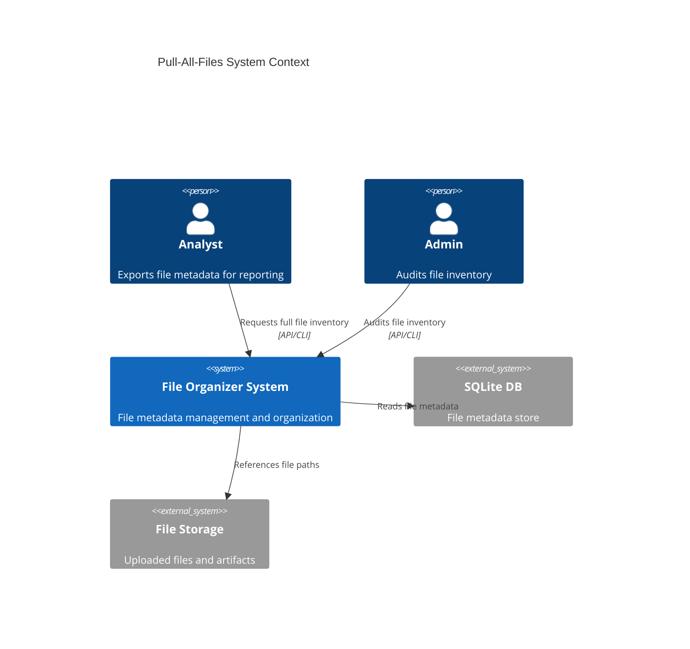
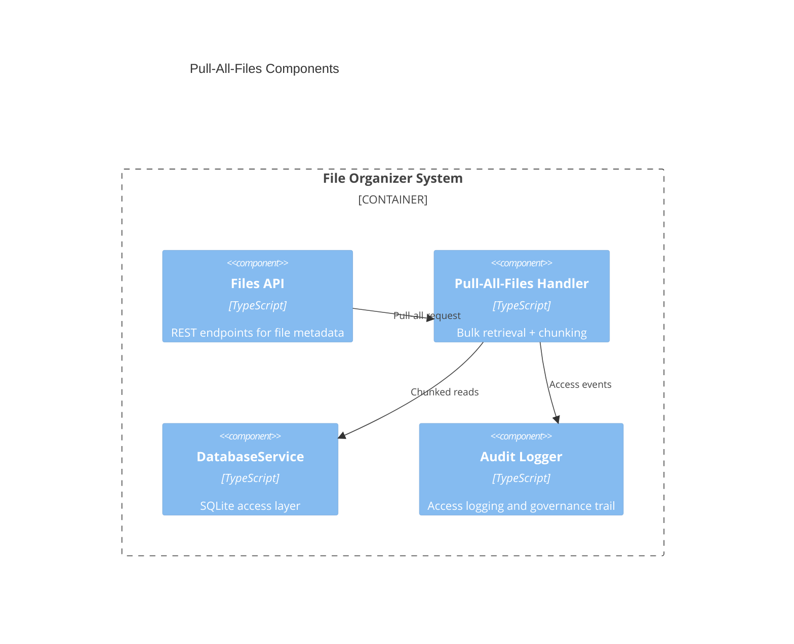
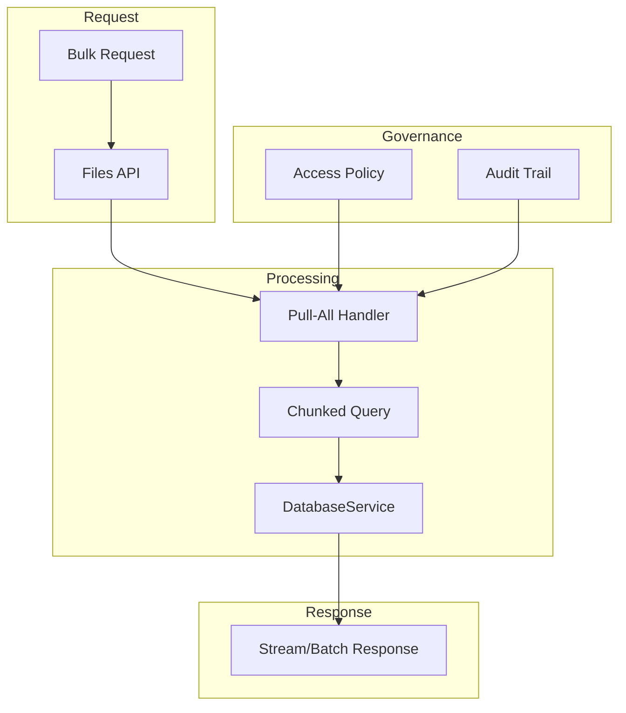
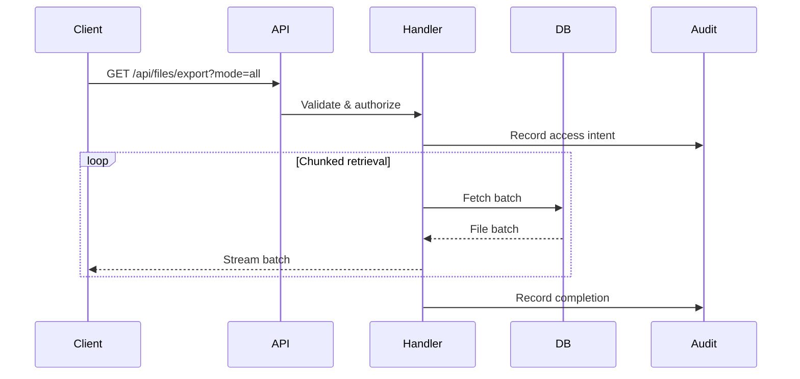

# GL Unified Charter Activated
# Pull-All-Files Architecture

<!-- GL Layer: GL30-49 Execution Layer -->
<!-- Purpose: Define architecture for pull-all-files retrieval in the File Organizer system -->

## Executive Summary

This document defines the architecture for the "pull all files" capability in the File Organizer
system. The goal is to support governance-aligned, bulk file retrieval for exports and analytics
without breaking existing pagination defaults or overwhelming runtime resources.

## Context & Scope

### Context
- File metadata is stored in the File Organizer SQLite database via `DatabaseService`.
- Existing APIs are paginated for safety and responsiveness.
- Issue #326 requests a clear architectural path to pull all file records.

### Scope
- Architecture definition for a pull-all-files capability.
- API interaction, governance controls, and data flow.
- No runtime or schema changes are introduced in this document.

## System Context Diagram

## Component Diagram

## Data Flow Diagram

## Sequence Diagram

## Requirements

### Functional
- Provide an explicit pull-all-files entry point (export endpoint or mode flag).
- Support chunked/streamed retrieval to avoid memory pressure.
- Preserve default pagination for existing `/api/files` usage.

### Non-Functional
- **Performance**: Batch size tuned to avoid timeouts and memory spikes.
- **Reliability**: Partial failure handling with resumable export metadata.
- **Security**: Require authorization scope for bulk access; redact sensitive paths when needed.
- **Auditability**: Emit access logs for every bulk retrieval request.

## GL Governance Mapping

| Artifact | Location | GL Layer | Rationale |
| --- | --- | --- | --- |
| Pull-All-Files Architecture | `docs/architecture/pull_all_files_Architecture.md` | GL30-49 | Execution-layer API design guidance |
| Pull-All-Files ADR | `docs/adr/ADR-002-pull-all-files.md` | GL10-29 | Operational decision record |

## Architecture Decisions & Rationale

### Decision: Explicit Export Path
Bulk retrieval is gated behind an explicit export path or mode flag to preserve existing pagination
defaults and prevent accidental large responses.

### Decision: Chunked Streaming
Bulk responses are streamed or batched to prevent memory spikes and timeouts during large exports.
