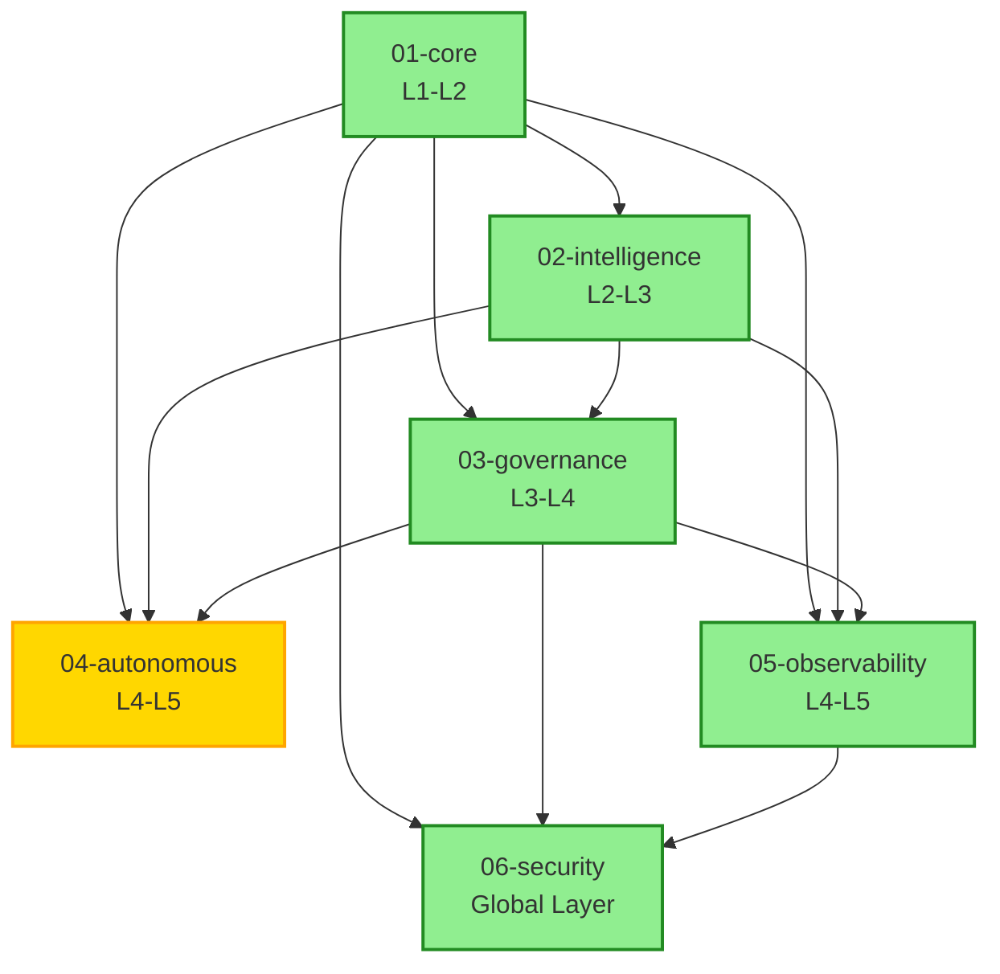

# Module Dependency DAG Visualization

**Generated**: 2026-01-18 08:56:30 UTC  
**Purpose**: Visualize module dependencies and governance structure

---

## 📊 Dependency Graph (Mermaid)




**Legend**:
- 🟢 Green: Active modules
- 🟡 Yellow: In development
- ⚪ Gray: Planned modules
- Arrows point from dependency to dependent (bottom-up)

---

## 🌳 ASCII Tree View

```
Module Dependency Tree (Bottom-Up)
============================================================

├─ 🟢 01-core (L1-L2)
  ├─ 🟢 02-intelligence (L2-L3)
  │  └─ depends on: 01-core
    ├─ 🟢 03-governance (L3-L4)
    │  ├─ depends on: 01-core
    │  └─ depends on: 02-intelligence
      ├─ 🟡 04-autonomous (L4-L5)
      │  ├─ depends on: 01-core
      │  ├─ depends on: 02-intelligence
      │  └─ depends on: 03-governance
      ├─ 🟢 05-observability (L4-L5)
      │  ├─ depends on: 01-core
      │  ├─ depends on: 02-intelligence
      │  └─ depends on: 03-governance
        ├─ 🟢 06-security (Global Layer)
        │  ├─ depends on: 01-core
        │  ├─ depends on: 03-governance
        │  └─ depends on: 05-observability

```

---

## 📈 Statistics

Dependency Statistics
============================================================

Total Modules: 6
Total Dependencies: 12
Maximum Depth: 4
Cycles Detected: 0

Leaf Modules (no dependencies): 1
  - 01-core

Modules with Most Dependencies:
  - 04-autonomous: 3 dependencies
  - 05-observability: 3 dependencies
  - 06-security: 3 dependencies

Depth Distribution:
  Level 0: 1 modules █
  Level 1: 1 modules █
  Level 2: 1 modules █
  Level 3: 2 modules ██
  Level 4: 1 modules █


---

## 🔍 Detailed Dependency Matrix

| Module | Dependencies | Dependents | Depth |
|--------|--------------|------------|-------|
| 01-core | none | 02-intelligence, 03-governance, 04-autonomous, 05-observability, 06-security | 0 |
| 02-intelligence | 01-core | 03-governance, 04-autonomous, 05-observability | 1 |
| 03-governance | 01-core, 02-intelligence | 04-autonomous, 05-observability, 06-security | 2 |
| 04-autonomous | 01-core, 02-intelligence, 03-governance | none | 3 |
| 05-observability | 01-core, 02-intelligence, 03-governance | 06-security | 3 |
| 06-security | 01-core, 03-governance, 05-observability | none | 4 |


---

## 🔗 Export Formats

This visualization is available in multiple formats:

1. **Mermaid Diagram** (embedded above) - Render in GitHub, GitLab, or Mermaid Live Editor
2. **DOT Graph** (`module-dependencies.dot`) - Use with Graphviz
3. **ASCII Tree** (embedded above) - Plain text representation
4. **JSON Data** (`module-dependencies.json`) - Machine-readable format

### Using Graphviz

To generate PNG from DOT file:

```bash
dot -Tpng docs/dag-visualization/module-dependencies.dot -o module-dependencies.png
```

### Using Mermaid CLI

```bash
mmdc -i docs/DAG_VISUALIZATION.md -o dag-visualization.png
```

---

## 📚 Related Documentation

- [Module Registry](../../controlplane/baseline/modules/REGISTRY.yaml)
- [Integration Guide](../PHASE1_INTEGRATION_GUIDE.md)
- [Governance Dashboard](../LANGUAGE_GOVERNANCE_DASHBOARD.md)

---

*This visualization is automatically generated from the module registry.*
