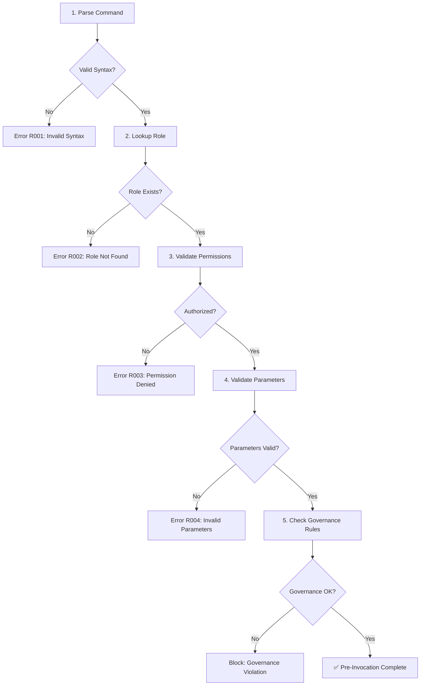
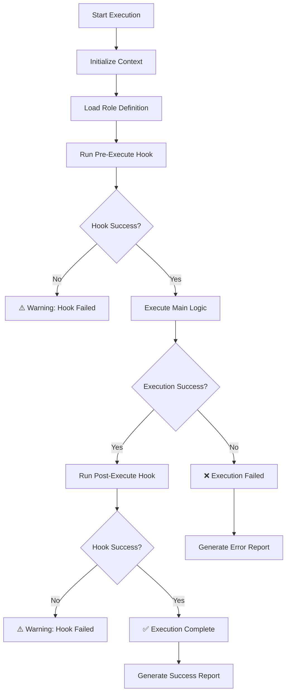
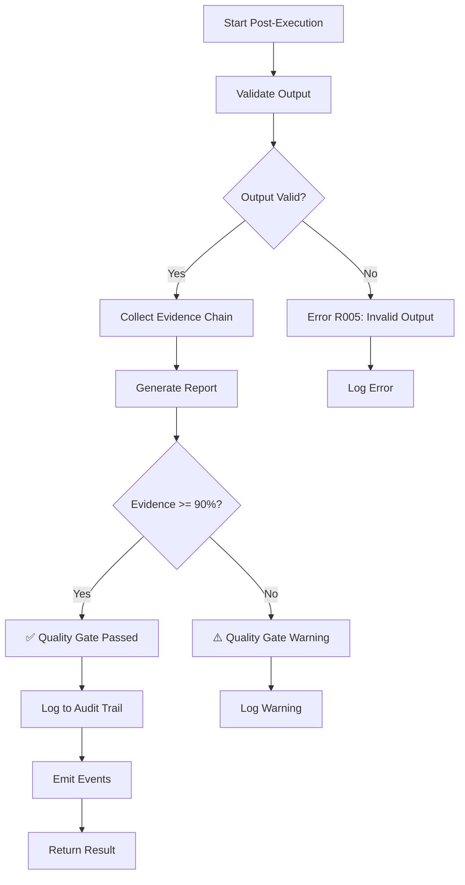
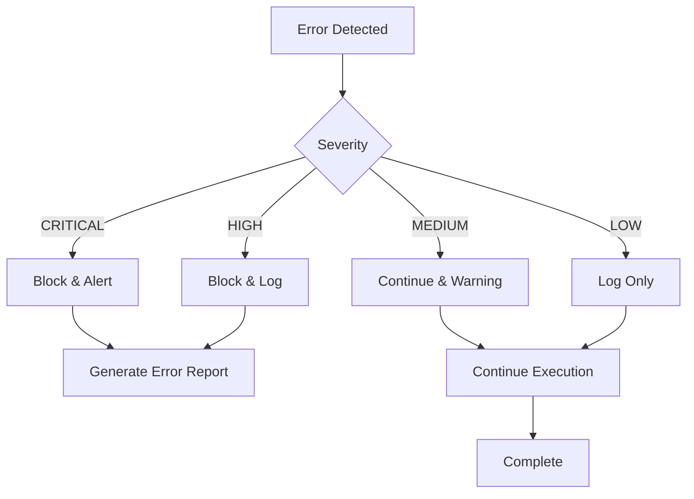
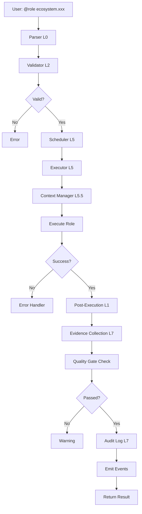

# MNGA Role Runtime Flow Specification
## Version: 1.0.0
## Layer: MNGA-L5.5 (Role Execution Layer)

---

## Overview

The Role Runtime Flow specification defines the complete execution lifecycle for role invocations in MNGA. This ensures all role executions follow a standardized, governable, and auditable workflow from invocation to completion.

---

## 1. Architecture Components

### 1.1 Core Components

```
┌─────────────────────────────────────────────────────────────┐
│                    MNGA Role Execution Layer                  │
│                          (L5.5)                              │
├─────────────────────────────────────────────────────────────┤
│                                                               │
│  ┌──────────────┐    ┌──────────────┐    ┌──────────────┐   │
│  │   Parser     │───▶│   Scheduler  │───▶│  Executor    │   │
│  │  (L0)        │    │   (L5)       │    │   (L5)       │   │
│  └──────────────┘    └──────────────┘    └──────────────┘   │
│         │                   │                   │           │
│         │                   │                   │           │
│         ▼                   ▼                   ▼           │
│  ┌──────────────┐    ┌──────────────┐    ┌──────────────┐   │
│  │  Validator   │    │   Context    │    │   Monitor    │   │
│  │  (L2)        │    │  Manager     │    │   (L7)       │   │
│  └──────────────┘    └──────────────┘    └──────────────┘   │
│                                                               │
└─────────────────────────────────────────────────────────────┘
```

### 1.2 Component Responsibilities

| Component | Responsibility | MNGA Layer |
|-----------|---------------|------------|
| Parser | Parse `@role` syntax, extract parameters | L0 |
| Validator | Validate role existence, permissions, parameters | L2 |
| Scheduler | Schedule execution, manage queue | L5 |
| Context Manager | Manage semantic context across layers | L5.5 |
| Executor | Execute role logic in isolated environment | L5 |
| Monitor | Track execution, collect metrics, handle events | L7 |
| Audit Logger | Log all operations to audit trail | L7 |

---

## 2. Execution Lifecycle

### 2.1 Phase 1: Pre-Invocation (Blocking)

**Objective**: Validate everything before execution



#### Pre-Invocation Steps:

1. **Parse Command** (L0)
   - Parse `@role <role-id> <input> [options]`
   - Extract: role-id, input, parameters
   - Generate `invocation_id` (UUID)

2. **Lookup Role** (L3)
   - Query role registry
   - Load role definition from JSON
   - Validate role is ACTIVE

3. **Validate Permissions** (L7)
   - Check caller permissions against role requirements
   - Validate RBAC rules
   - Generate permission evidence

4. **Validate Parameters** (L1)
   - Validate parameter types against schema
   - Check required parameters
   - Validate parameter constraints

5. **Check Governance Rules** (L2)
   - Check constraints (e.g., max scan depth)
   - Validate semantic tags
   - Check evidence requirements

**Outcome**: Either execution proceeds OR is blocked with error

---

### 2.2 Phase 2: Execution (Non-Blocking)

**Objective**: Execute role logic safely



#### Execution Steps:

1. **Initialize Context** (L5.5)
   - Create execution context
   - Set semantic tags
   - Initialize evidence chain

2. **Load Role Definition**
   - Load role JSON definition
   - Validate schema version
   - Load dependencies

3. **Run Pre-Execute Hook** (if defined)
   - Execute `hooks.pre_execute` script
   - Capture output
   - Continue regardless of result (logs warning)

4. **Execute Main Logic**
   - Execute role implementation
   - Capture output
   - Track execution metrics

5. **Run Post-Execute Hook** (if defined)
   - Execute `hooks.post_execute` script
   - Capture output
   - Continue regardless of result (logs warning)

**Outcome**: Success or failure with detailed report

---

### 2.3 Phase 3: Post-Execution (Non-Blocking)

**Objective**: Validate, audit, and report



#### Post-Execution Steps:

1. **Validate Output** (L1)
   - Validate output against role schema
   - Check required fields
   - Validate data types

2. **Collect Evidence Chain**
   - Collect execution logs
   - Collect parameter values
   - Collect output checksums
   - Generate SHA-256 hashes

3. **Generate Report**
   - Create execution report
   - Include all evidence
   - Calculate evidence coverage

4. **Quality Gate Check**
   - Check evidence coverage >= 90%
   - Check for forbidden phrases
   - Check source consistency

5. **Log to Audit Trail** (L7)
   - Log to `all_validations` table
   - Log to `evidence_validations` table
   - Generate audit ID

6. **Emit Events**
   - Emit `ROLE_EXECUTION_COMPLETE` event
   - Emit metrics to monitoring system
   - Trigger downstream actions

**Outcome**: Complete audit trail, events emitted, result returned

---

## 3. Execution Modes

### 3.1 Synchronous Execution

**Use Case**: Quick operations (< 60 seconds)

```python
# Example
result = await execute_role(
    role_id="ecosystem.validator",
    input="contract.yaml",
    parameters={"strict_mode": True}
)
# Returns immediately
```

**Behavior**:
- Waits for completion
- Returns result or throws exception
- Used in CI/CD pipelines

### 3.2 Asynchronous Execution

**Use Case**: Long-running operations (> 60 seconds)

```python
# Example
job_id = await execute_role_async(
    role_id="ecosystem.architect",
    input="ecosystem/",
    parameters={"depth": "full"}
)
# Returns job_id immediately
result = await get_job_result(job_id)
```

**Behavior**:
- Returns job ID immediately
- Poll for status
- Download result when ready
- Used for analysis tasks

### 3.3 Streaming Execution

**Use Case**: Real-time monitoring

```python
# Example
async for chunk in execute_role_stream(
    role_id="ecosystem.analyst",
    input="ecosystem/",
    parameters={"stream": True}
):
    print(chunk)
```

**Behavior**:
- Streams results as available
- Real-time progress updates
- Used for monitoring and debugging

---

## 4. Error Handling

### 4.1 Error Classification

| Severity | Action | Example |
|----------|--------|---------|
| CRITICAL | Block execution, alert | Role not found, permission denied |
| HIGH | Block execution, log | Invalid parameters, timeout |
| MEDIUM | Continue with warning | Hook failed, low evidence coverage |
| LOW | Log only | Deprecated parameter usage |

### 4.2 Error Recovery



### 4.3 Retry Policy

Only applies to **HIGH** severity errors:

```yaml
retry_policy:
  max_retries: 2
  backoff: "exponential"
  backoff_factor: 1.5
  retryable_errors:
    - "timeout"
    - "network_error"
    - "temporary_failure"
```

**Retry Logic**:
1. Wait `backoff_factor * (2 ^ attempt)` seconds
2. Re-execute role
3. If max_retries exceeded, fail permanently

---

## 5. Monitoring & Metrics

### 5.1 Metrics Collected

```json
{
  "role_invocations_total": 1250,
  "role_invocations_success": 1200,
  "role_invocations_failed": 50,
  "role_execution_duration_ms_p50": 1500,
  "role_execution_duration_ms_p95": 5000,
  "role_execution_duration_ms_p99": 10000,
  "role_evidence_coverage_avg": 0.92
}
```

### 5.2 Events Emitted

| Event | Description |
|-------|-------------|
| `ROLE_INVOCATION_START` | Role execution started |
| `ROLE_EXECUTION_COMPLETE` | Role execution finished |
| `ROLE_EXECUTION_FAILED` | Role execution failed |
| `QUALITY_GATE_FAILED` | Evidence coverage < 90% |
| `GOVERNANCE_VIOLATION` | Governance rule violated |

---

## 6. Audit Trail

### 6.1 Audit Log Structure

```json
{
  "audit_id": "uuid-v4",
  "invocation_id": "uuid-v4",
  "role_id": "ecosystem.runner",
  "timestamp": "2025-01-01T00:00:00Z",
  "actor": "user:john.doe",
  "action": "execute_role",
  "resource": "ecosystem/",
  "result": "success",
  "duration_ms": 1500,
  "evidence_links": [
    "file:ecosystem/index.json#sha256:abc123...",
    "log:execution.log#lines:1-100"
  ],
  "metadata": {
    "correlation_id": "uuid-v4",
    "request_id": "uuid-v4"
  }
}
```

### 6.2 Audit Tables

| Table | Purpose |
|-------|---------|
| `all_validations` | All role executions |
| `role_executions` | Role-specific metrics |
| `evidence_validations` | Evidence chain validation |
| `quality_gate_validations` | Quality gate results |

---

## 7. Security Considerations

### 7.1 Role Isolation

Each role executes in:
- **Docker container** (production)
- **Web Worker** (development)
- **Process** (fallback)

### 7.2 Resource Limits

```yaml
runtime_behavior:
  timeout: 300  # seconds
  memory_limit: "1GB"
  cpu_limit: "1000m"
```

### 7.3 Permission Validation

- RBAC check before execution
- Capability check before access
- Audit log for all actions

---

## 8. Integration Points

### 8.1 MNGA Layer Integration

```
L0 (Language)     → Parser
L1 (Format)       → Parameter validation, output schema
L2 (Semantic)     → Governance rules, semantic tags
L3 (Index)        → Role registry lookup
L4 (Topology)     → Artifact dependencies
L5 (Enforcement)  → Execution engine
L5.5 (Role)       → Role execution layer
L6 (Reasoning)    → Semantic analysis
L7 (Monitoring)   → Audit logging, events
```

### 8.2 CI/CD Integration

```yaml
# GitHub Actions example
- name: "Run role"
  run: "@role ecosystem.validator validate contracts/"
  
- name: "Upload evidence"
  uses: actions/upload-artifact@v3
  with:
    name: role-execution-evidence
    path: .mnga/evidence/
```

---

## 9. Performance Optimization

### 9.1 Caching

- Role definitions cached in memory
- Registry lookup cached (TTL: 5 minutes)
- Schema validation results cached

### 9.2 Parallel Execution

Multiple roles can execute in parallel if:
- No shared resources
- No dependencies
- Different semantic contexts

### 9.3 Lazy Loading

- Role implementations loaded on-demand
- Dependencies resolved only when needed

---

## 10. Troubleshooting

### 10.1 Common Issues

| Issue | Cause | Solution |
|-------|-------|----------|
| Role not found | Incorrect role ID | Check registry |
| Permission denied | Missing permissions | Update RBAC |
| Timeout | Long-running task | Increase timeout |
| Evidence coverage low | Missing evidence | Add evidence collection |

### 10.2 Debug Mode

```bash
# Enable debug logging
export MNGA_DEBUG=true

# Execute role with debug
@role ecosystem.runner scan / --debug=true
```

---

## Appendix A: Flow Diagram (Complete)



---

## Appendix B: State Machine

```
┌─────────┐     ┌──────────┐     ┌──────────┐     ┌─────────┐
│  READY  │────▶│ PARSING  │────▶│ VALIDATE │────▶│ SCHEDULE │
└─────────┘     └──────────┘     └──────────┘     └─────────┘
                                                          │
                                                          ▼
                                                  ┌──────────┐
                                                  │ EXECUTING │
                                                  └──────────┘
                                                          │
                                         ┌────────────────┴────────────────┐
                                         ▼                                 ▼
                                    ┌─────────┐                      ┌─────────┐
                                    │ SUCCESS │                      │ FAILURE │
                                    └─────────┘                      └─────────┘
                                         │                                 │
                                         └────────────────┬────────────────┘
                                                          ▼
                                                  ┌──────────┐
                                                  │ AUDITING │
                                                  └──────────┘
                                                          │
                                                          ▼
                                                  ┌──────────┐
                                                  │ COMPLETE │
                                                  └──────────┘
```

---

## Version History

| Version | Date | Changes |
|---------|------|---------|
| 1.0.0 | 2025-01-01 | Initial specification |

---

## Implementation Status

- ✅ Architecture defined
- ✅ Execution lifecycle specified
- ✅ Error handling defined
- ✅ Monitoring and audit defined
- ⏳ Parser implementation pending
- ⏳ Executor implementation pending
- ⏳ Context manager implementation pending
- ⏳ CI/CD integration pending