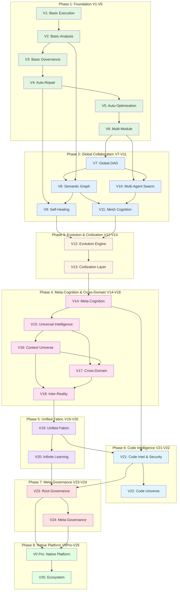
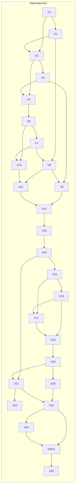
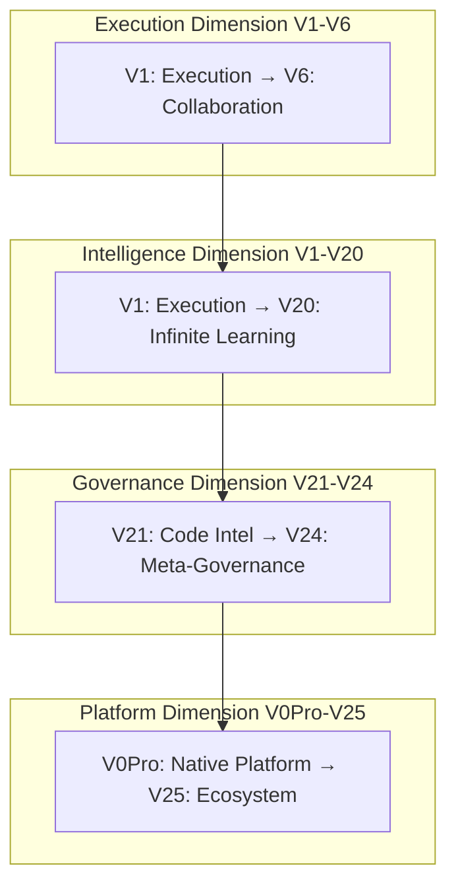

# GL Runtime Evolution Diagram

## Complete Evolution Path Visualization

### Overall Architecture Flow



### Layer Hierarchy

```mermaid
graph TB
    subgraph "Meta-Governance Layer"
        V24[V24: Meta-Governance]
    end
    
    subgraph "Root Governance Layer"
        V23[V23: Root Governance]
    end
    
    subgraph "Code Intelligence Layer"
        V22[V22: Code Universe]
        V21[V21: Code Intel & Security]
    end
    
    subgraph "Intelligence Fabric Layer"
        V20[V20: Infinite Learning]
        V19[V19: Unified Fabric]
        V18[V18: Inter-Reality]
        V17[V17: Cross-Domain]
        V16[V16: Context Universe]
        V15[V15: Universal Intelligence]
    end
    
    subgraph "Meta-Cognition Layer"
        V14[V14: Meta-Cognition]
    end
    
    subgraph "Civilization Layer"
        V13[V13: Civilization]
    end
    
    subgraph "Evolution Layer"
        V12[V12: Evolution Engine]
    end
    
    subgraph "Cognitive Mesh Layer"
        V11[V11: Mesh Cognition]
    end
    
    subgraph "Multi-Agent Layer"
        V10[V10: Multi-Agent Swarm]
    end
    
    subgraph "Self-Healing Layer"
        V9[V9: Self-Healing]
    end
    
    subgraph "Semantic Layer"
        V8[V8: Semantic Graph]
    end
    
    subgraph "DAG Layer"
        V7[V7: Global DAG]
    end
    
    subgraph "Collaboration Layer"
        V6[V6: Multi-Module]
    end
    
    subgraph "Optimization Layer"
        V5[V5: Auto-Optimization]
    end
    
    subgraph "Repair Layer"
        V4[V4: Auto-Repair]
    end
    
    subgraph "Governance Layer"
        V3[V3: Basic Governance]
    end
    
    subgraph "Analysis Layer"
        V2[V2: Basic Analysis]
    end
    
    subgraph "Execution Layer"
        V1[V1: Basic Execution]
    end
    
    V24 -.-> V23
    V23 -.-> V22
    V22 -.-> V21
    V21 -.-> V20
    V20 -.-> V19
    V19 -.-> V18
    V18 -.-> V17
    V17 -.-> V16
    V16 -.-> V15
    V15 -.-> V14
    V14 -.-> V13
    V13 -.-> V12
    V12 -.-> V11
    V11 -.-> V10
    V10 -.-> V9
    V9 -.-> V8
    V8 -.-> V7
    V7 -.-> V6
    V6 -.-> V5
    V5 -.-> V4
    V4 -.-> V3
    V3 -.-> V2
    V2 -.-> V1
```



### Dependency Matrix



### Phase Timeline

```mermaid
gantt
    title GL Runtime Evolution Timeline
    dateFormat  YYYY-MM-DD
    section Phase 1
    Basic Execution       :done, v1, 2024-01-01, 7d
    Basic Analysis        :done, v2, after v1, 7d
    Basic Governance      :done, v3, after v2, 7d
    Auto-Repair           :done, v4, after v3, 7d
    Auto-Optimization     :done, v5, after v4, 7d
    Multi-Module          :done, v6, after v5, 7d
    
    section Phase 2
    Global DAG            :done, v7, after v6, 7d
    Semantic Graph        :done, v8, after v7, 7d
    Self-Healing          :done, v9, after v8, 7d
    Multi-Agent Swarm     :done, v10, after v9, 7d
    Mesh Cognition        :done, v11, after v10, 7d
    
    section Phase 3
    Evolution Engine      :done, v12, after v11, 14d
    Civilization Layer    :done, v13, after v12, 14d
    
    section Phase 4
    Meta-Cognition        :done, v14, after v13, 14d
    Universal Intelligence :done, v15, after v14, 14d
    Context Universe      :done, v16, after v15, 14d
    Cross-Domain          :done, v17, after v16, 14d
    Inter-Reality         :done, v18, after v17, 14d
    
    section Phase 5
    Unified Fabric        :done, v19, after v18, 21d
    Infinite Learning      :done, v20, after v19, 21d
    
    section Phase 6
    Code Intelligence     :done, v21, after v20, 14d
    Code Universe         :active, v22, after v21, 14d
    
    section Phase 7
    Root Governance       :done, v23, after v20, 21d
    Meta-Governance       :done, v24, after v23, 21d
    
    section Phase 8
    Native Platform       :done, v0pro, after v24, 28d
    Ecosystem             :planned, v25, after v0pro, 28d
```

### Layer Dimensions



### Core Evolution Logic

```mermaid
graph LR
    A[Execution<br/>Do] --> B[Analysis<br/>Understand]
    B --> C[Repair<br/>Fix]
    C --> D[Optimize<br/>Improve]
    D --> E[Collaborate<br/>Work Together]
    E --> F[Coordinate<br/>Orchestrate]
    F --> G[Reason<br/>Think]
    G --> H[Evolve<br/>Adapt]
    H --> I[Civilize<br/>Build Society]
    I --> J[Reflect<br/>Know Thyself]
    J --> K[Generalize<br/>Universal]
    K --> L[Integrate<br/>Context]
    L --> M[Cross<br/>Domains]
    M --> N[Multi<br/>Realities]
    N --> O[Unify<br/>One Fabric]
    O --> P[Learn<br/>Forever]
    P --> Q[Code<br/>Intelligence]
    Q --> R[Govern<br/>Everything]
    R --> S[Meta<br/>Govern]
    S --> T[Platform<br/>Native]
    T --> U[Ecosystem<br/>Complete]
```



---

**Note:** All diagrams can be rendered in GitHub using Mermaid syntax.