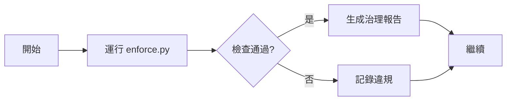
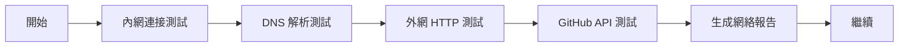
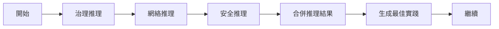

# MNGA 內網+外網交互驗證與自動推理系統

## 📋 概述

這是一個完整的內網+外網交互驗證與自動推理最佳實踐系統，整合了治理檢查、網絡驗證和智能推理引擎。

## 🏗️ 系統架構

```
┌─────────────────────────────────────────────────────────────┐
│              MNGA 網絡交互驗證與自動推理系統                    │
├─────────────────────────────────────────────────────────────┤
│                                                               │
│  ┌──────────────┐    ┌──────────────┐    ┌──────────────┐   │
│  │   治理檢查    │───▶│  網絡驗證    │───▶│  自動推理    │   │
│  │  (enforce.py)│    │ (validator)  │    │ (reasoner)   │   │
│  └──────────────┘    └──────────────┘    └──────────────┘   │
│         │                   │                   │           │
│         ▼                   ▼                   ▼           │
│  ┌──────────────┐    ┌──────────────┐    ┌──────────────┐   │
│  │  治理報告    │    │  網絡報告    │    │  推理報告    │   │
│  └──────────────┘    └──────────────┘    └──────────────┘   │
│         │                   │                   │           │
│         └───────────────────┴───────────────────┘           │
│                             │                               │
│                             ▼                               │
│                   ┌──────────────────┐                     │
│                   │   最終驗證報告   │                     │
│                   └──────────────────┘                     │
│                                                               │
└─────────────────────────────────────────────────────────────┘
```

## 🔧 核心組件

### 1. 網絡驗證器 (NetworkValidator)

**文件**: `ecosystem/validators/network_validator.py`

**功能**:
- ✅ 內網連接性測試
- ✅ DNS 解析測試
- ✅ 外網 HTTP 連接測試
- ✅ GitHub API 連接測試
- ✅ 延遲監控
- ✅ 自動建議生成

**測試類型**:
- **INTERNAL**: 內網服務連接測試
- **EXTERNAL**: 外網 API 連接測試
- **HYBRID**: 內外網混合測試（如 DNS）

### 2. 自動推理引擎 (AutoReasoner)

**文件**: `ecosystem/reasoning/auto_reasoner.py`

**功能**:
- ✅ 基於規則的推理引擎
- ✅ 治理規則推理
- ✅ 網絡規則推理
- ✅ 安全規則推理
- ✅ 最佳實踐建議
- ✅ 優先級分類（CRITICAL, HIGH, MEDIUM, LOW）

**推理規則類型**:
- **GR001**: 證據覆蓋率規則
- **GR002**: GL 語義錨點規則
- **GR003**: 邊界違規規則
- **NR001**: 外網連接規則
- **NR002**: 延遲閾值規則
- **SR001**: Token 洩露規則
- **SR002**: 權限規則

### 3. 統一驗證入口 (verify_network_interaction.py)

**文件**: `ecosystem/verify_network_interaction.py`

**功能**:
- ✅ 整合治理檢查、網絡驗證、自動推理
- ✅ 統一命令行接口
- ✅ JSON 輸出格式
- ✅ 自動報告生成
- ✅ 審計日誌支持

## 🚀 使用方法

### 基本用法

```bash
# 運行完整驗證
python3 ecosystem/verify_network_interaction.py

# 啟用審計模式
python3 ecosystem/verify_network_interaction.py --audit

# JSON 格式輸出
python3 ecosystem/verify_network_interaction.py --json

# 指定輸出文件
python3 ecosystem/verify_network_interaction.py --output /path/to/report.json
```

### 高級選項

```bash
# 跳過網絡驗證
python3 ecosystem/verify_network_interaction.py --skip-network

# 跳過自動推理
python3 ecosystem/verify_network_interaction.py --skip-reasoning

# 完整選項組合
python3 ecosystem/verify_network_interaction.py --audit --json --output report.json
```

### 單獨運行組件

```bash
# 只運行網絡驗證
python3 ecosystem/validators/network_validator.py

# 只運行自動推理
python3 ecosystem/reasoning/auto_reasoner.py

# 只運行治理檢查
python3 ecosystem/enforce.py --audit
```

## 📊 驗證流程

### 第一階段：治理檢查


### 第二階段：網絡驗證


### 第三階段：自動推理


## 📈 輸出報告

### 報告結構

```json
{
  "timestamp": "2026-02-03T07:43:07Z",
  "version": "1.0.0",
  "verification_summary": {
    "governance_check": "PASS",
    "network_validation": "PASS",
    "auto_reasoning": "COMPLETED"
  },
  "overall_status": "PASS",
  "governance": {
    "status": "PASS",
    "violations": []
  },
  "network": {
    "test_summary": {
      "total_tests": 4,
      "passed": 4,
      "failed": 0,
      "success_rate": "100.0%",
      "average_latency_ms": "735.85"
    },
    "tests": [...],
    "recommendations": [...]
  },
  "reasoning": {
    "summary": {
      "total_inferences": 0,
      "critical": 0,
      "high": 0,
      "medium": 0,
      "low": 0,
      "overall_health": "HEALTHY"
    },
    "reasoning_results": [],
    "best_practices": [...]
  },
  "metadata": {
    "ecosystem_root": "/workspace/machine-native-ops/ecosystem",
    "verification_type": "NETWORK_INTERACTION_AND_AUTO_REASONING"
  }
}
```

### 報告位置

默認報告保存在: `reports/network_interaction_report_YYYYMMDD_HHMMSS.json`

## 🎯 最佳實踐

### 開發階段
```bash
# 定期運行驗證
python3 ecosystem/verify_network_interaction.py

# 查看 JSON 輸出
python3 ecosystem/verify_network_interaction.py --json
```

### CI/CD 集成
```yaml
# GitHub Actions 示例
- name: "Run Network Verification"
  run: python3 ecosystem/verify_network_interaction.py --json
  
- name: "Upload Report"
  uses: actions/upload-artifact@v3
  with:
    name: verification-report
    path: reports/*.json
```

### 部署前驗證
```bash
# 完整驗證流程
python3 ecosystem/verify_network_interaction.py --audit --json --output pre-deploy-report.json

# 檢查結果
cat pre-deploy-report.json | jq '.overall_status'
```

## 🔍 故障排除

### 網絡連接失敗
```
❌ HTTP Connectivity Test (EXTERNAL): FAIL
```
**解決方案**:
1. 檢查網絡連接
2. 檢查代理設置
3. 檢查防火牆配置

### GitHub API 失敗
```
❌ GitHub API Test: FAIL
```
**解決方案**:
1. 驗證 GitHub token
2. 檢查 API 速率限制
3. 檢查倉庫權限

### 治理檢查失敗
```
❌ Governance Check: FAIL
```
**解決方案**:
1. 查看違規詳細信息
2. 修復證據鏈問題
3. 添加 GL 語義錨點

## 📚 相關文檔

- [MNGA 治理框架](./GOVERNANCE_FRAMEWORK.md)
- [角色執行系統](./ROLE_EXECUTION_SYSTEM.md)
- [GL 統一憲章](../governance/GL_UNIFIED_CHARTER.md)

## 🤝 貢獻

歡迎提交 Issue 和 Pull Request！

## 📄 許可證

MIT License

---

**版本**: 1.0.0  
**最後更新**: 2026-02-03  
**狀態**: ✅ Production Ready